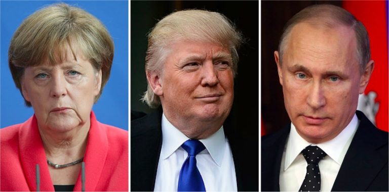
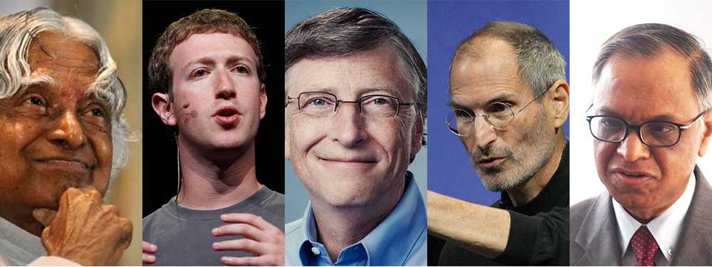
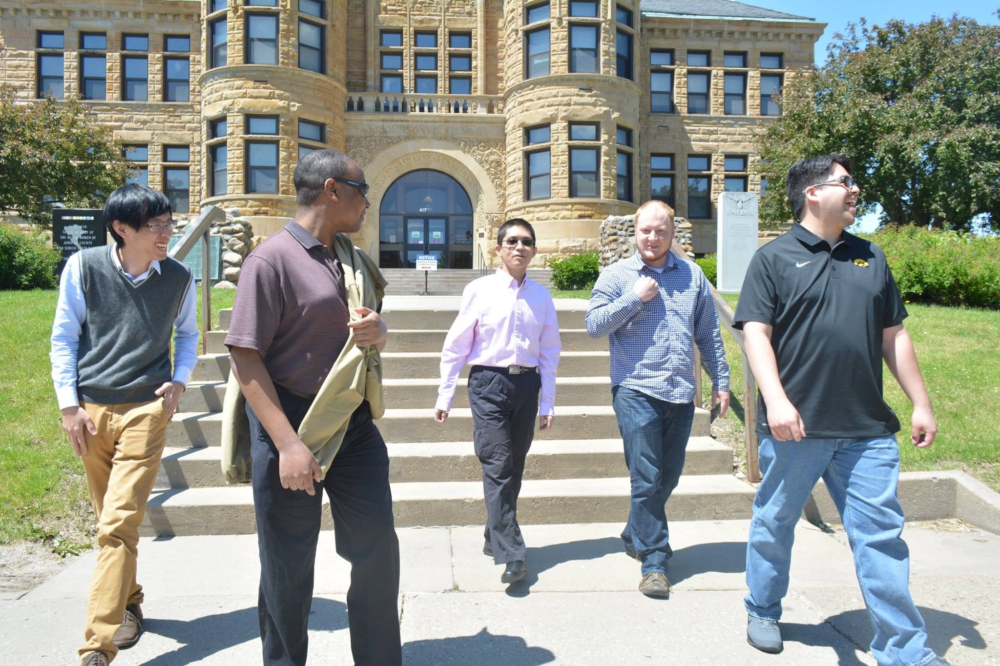
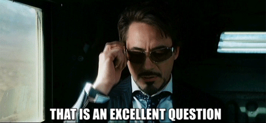
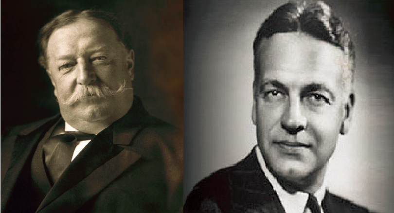

```{r setup, include = FALSE}
knitr::opts_chunk$set(echo = FALSE, message = FALSE, warning = FALSE, fig.pos = '!h')

library(pacman)
p_load(dotwhisker, ggplot2, interplot, # Visualization
       RefManageR, emo,# Applied
       # dependency
       readxl, haven, descr, stringi, stringr, arm, car, stargazer, data.table,
       broom, tidyverse) # data wrangling

set.seed(313)
```

# Overview

## Who am I?

* A Comparativist
* A Methodologist
* An Expert in Chinese Politics


* <div class="centered">

</div>

## Why taking this class?

* Because you can become: 
    + <span style="color:yellow">*The scientist outside the laboratory, the master of social complexity, the protector of political truth, and the breaker of rumors and conspiracies*</span>
    + <div class="centered"></div>

## Why taking this class (seriously)?

* Learn how to conduct research in **political science**.
* Learn how to **evaluate** arguments, evidence, and data.
* Contribute to your *degree*.

## Some highlights
* No final exam!
* Only one response paper!
* Only one final project!


----

More details?

* Let's go through the [syllabus](https://github.com/sammo3182/researchDesign/blob/master/POLI2000_syllabus.pdf).

# Let's call it for a day!
<div class="centered">

</div>

# Being a Political Scienist
## Who are the political scientists?
* Are they? <br><br><div class="centered">

</div>

----

* How about them?<br><br><div class="centered">

</div>

---

* Or them?<br><br><div class="centered">

</div>

* <span style="color:yellow">**NONE OF THEM!**</span>

## These are!
* <div class="centered">

</div>

## Why are they political scientists?

* They believe that they are scientists (lll￢ω￢).<br><br><div class="centered">

</div>
* They follow the same understanding of political science.
* They follow the same principles and procedures to study politics.

## What's political science?

* Politics: attempts 
    + Organize human groups to determine internal rules
    + Compete and cooperate with other organized groups
    + Reactions to such attempts.
    
* How is it different from 
    + Sociology?
    + Pyschology?
    + Anthopology?
    + History?
    + Journalism
    
## What's Science?
* Can we use the criteria from social science?<br><br><div class="centered">

</div>

----

* Science: Procedure
    + Publicly known
    + Make and evaluate inferences
    + Self-conscious application of methods that are themselves subject to public evaluation. 
    
* Political Science: *The study of politics through the procedures of science*.


## How to do it correctly?
Step I : Ask a question

* How did the Charlottesville event happen?
* Commonly acceptable national health plan?
* How dare Kim Jong-un goes against the whole world?

* Are they proper questions?<br><br><div class="centered">

</div>
    
----
    
* Yes and no
    + Puzzle: what we observe <span style="color:yellow">does not fit</span> with our preconceptions based on established theory.
    + Substantively important: <span style="color:yellow">Whose mind are you going to change about what?</span>

## Step II: Clarify your object
* Conceptualization
    + Explicit
    + Consistent
    
## Step III: Inference
* Descriptive inference: <br><br>Established premises + a particular set of facts $\rightarrow$ general conclusions.
    + e.g., Democratic Peace, IOs reduce conflicts
    + Reliability
    + Validity
* Causal Inference: Counterfactual situation
    + e.g., ?
    + Difficult
    
## Step IV: Presentation
* Structure
    + Title:
        + "The effect of IGOs on interstate conflict"?
        + Key point + Argument
            + "Mediating interstate conflicts: Regional vs. global international organizations"
    + Abstract: short + powerful
    + Following professional presenting procedure
    + Clear words and plain languages
    
## A good political science research?

* They should look like her/him!<br><br><div class="centered">

</div>
<div class="centered">

</div>
            
## Who can do it right?
William Howard Taft vs. Robert Maynard Hutchins<br><br>
<div class="centered">

</div>