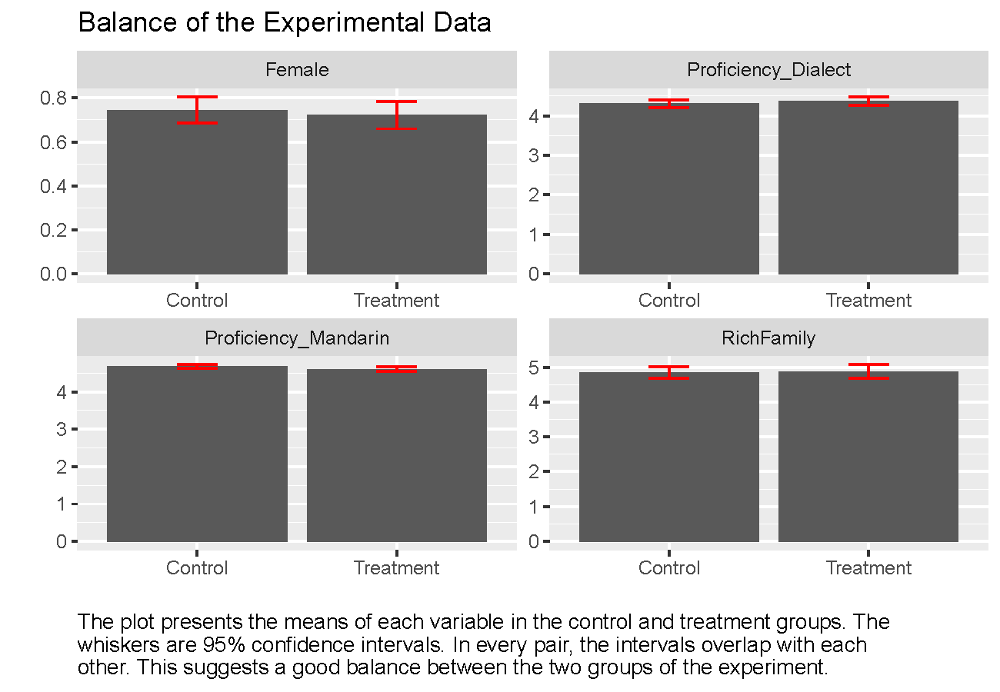
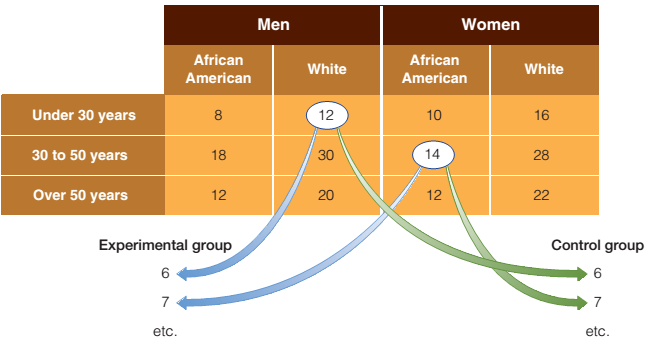
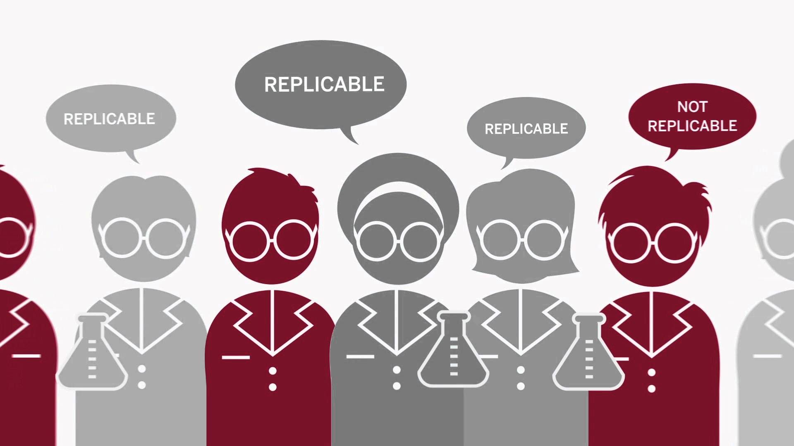
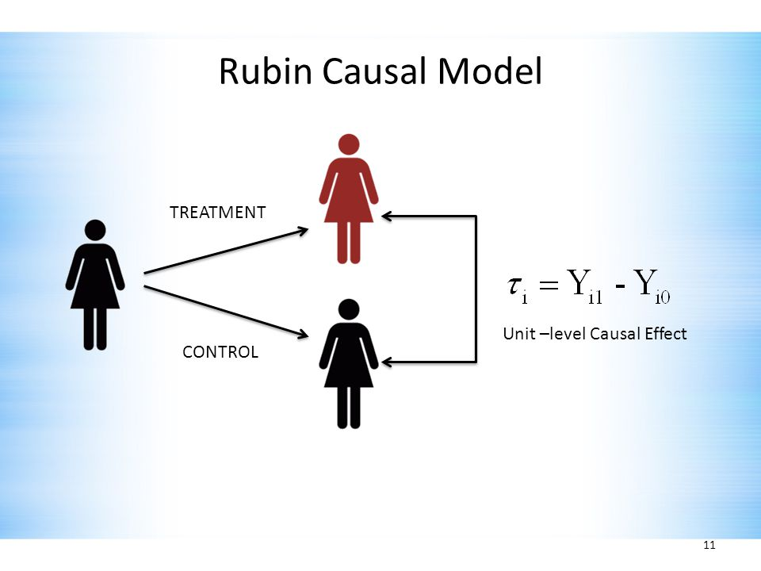
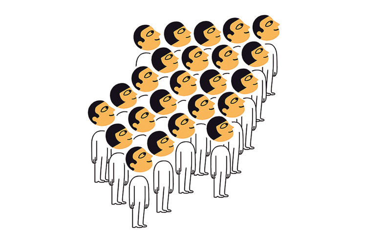

```{r setup, include = FALSE}
knitr::opts_chunk$set(echo = FALSE, message = FALSE, warning = FALSE)

library(pacman)
p_load(dotwhisker, ggplot2, interplot, # Visualization
       RefManageR, emo,# Applied
       # dependency
       readxl, haven, descr, stringi, stringr, arm, car, stargazer, data.table,
       broom, tidyverse) # data wrangling

set.seed(313)
```

## When should one use experiment

* Well-defined concept 
* Clear-stated propositions
* Small-group interaction

## Classical experiment

```{r}
library(knitr)
library(kableExtra)

text_tb <- data.frame(
  Test = c("Pretest", "Posttest"),
  Stim. = rep("Treatment", 2),
  NonStim. = rep("Control", 2)
)

kable(text_tb, "html", align = "lcc")%>%
  kable_styling(full_width = TRUE, font_size = 25) %>%
    add_header_above(c(" " = 1, "Assignment" = 2)) %>%
      column_spec(c(2,3), width = "6em")
```

<br>

* Do we always need pretest and posttest?
* Do we always need treatment and control groups?
* Double-blind?


## What does randomization bring us?

<div class="centered">

</div>

## How about matching?

<div style="float: left; width: 50%;">
* <div class="centered">

</div>
</div>

<div style="float: right; width: 50%;">
* <div class="centered">

</div>
</div>


## Validity

* Internal Validity
    + Construct validity
    + Causal validity
    + Statistical validity
    
    
## External vs. Ecological Validity

<div class="centered">

</div>

## How do experiments define causality?

* Rubin's causal model:
    + Treatment effect:<br><br><div class="centered">

</div>
        + ATE: $E(\tau_i) = E(Y_{i1}) - E(Y_{i0})$

----

Averaged treatment effect among the treated

* Why do we care?
* $E(\tau_i|T_i = 1) = E(Y_{i1}|T_i = 1) - E(Y_{i0}|T_i = 1)$
    

## Experimental assumptions

1. Independence
1. Exclusion restriction
1. Stable Unit Treatment Value Assumption (SUTVA)
1. Montonicity
1. Nonzero causal effects of assignment on treatment

## Independence

<div style="float: left; width: 50%;">
### Definition

Subject will have the same effect regardless which group they are in.

$$
\begin{aligned}
Assumption:& E(Y_{i1}|T_i = 1) = E(Y_{i1}|T_i = 0);\\
           & E(Y_{i0}|T_i = 1) = E(Y_{i0}|T_i = 0).\\
ATE:&        E(\tau_i) = E(Y_{i1}|T_i = 1) - E(Y_{i0}|T_i = 0).
\end{aligned}
$$
</div>


<div style="float: right; width: 50%;">
### Violation

* Nonrandom assignment
* Non-double-blind design

</div>


## Exclusion restriction

<div style="float: left; width: 50%;">
### Definition

Only treatment can make effects.

<div class="centered">

</div>
</div>

<div style="float: right; width: 50%;">
### Violation

* Subjects change their behaviors
* Third party effects
</div>


## SUTVA

<div style="float: left; width: 50%;">
### Definition

The effect of stimulus on one subject is affected by other subjects.
</div>


<div style="float: right; width: 50%;">
### Violation (e.g., Herd Effect)

* <div class="centered">

</div>

</div>

## Montonicity and nonzero causal effects

<div style="float: left; width: 50%;">
### Definition

* The probability the subject is treated is at least as great when the subject is in the treatment group as when the subject is in the control group.
* The treatment assignment has an effect on the probability that at least some subjects are treated.

</div>


<div style="float: right; width: 50%;">
### Violation

* Operation errors
* Third-party effects

</div>


## Field Experiment

<iframe width="560" height="315" src="https://www.youtube.com/embed/sE07Dmd87Os?start=7" frameborder="0" allowfullscreen></iframe>


----

* Subject: sample from the target population
* Pro: Ecological validity
* Con: Internal and external validity


## Natural Experiment

<iframe width="560" height="315" src="https://www.youtube.com/embed/jC8_88OqXa4?start=7" frameborder="0" allowfullscreen></iframe>

----

* Stimulation: It just happened.
* Pro: Ecological and external validity
* Con: Internal validity