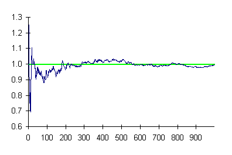

```{r setup, include = FALSE}
knitr::opts_chunk$set(echo = FALSE, message = FALSE, warning = FALSE)

library(pacman)
p_load(dotwhisker, ggplot2, interplot, # Visualization
       RefManageR, emo,# Applied
       knitr, kableExtra, # dependency
       readxl, haven, descr, stringi, stringr, arm, car, stargazer, data.table,
       broom, tidyverse) # data wrangling

set.seed(313)
```

## Confusions of case study

* Small-N
* Ethnographic analysis in the field
* Process-tracing
* Single-phenomenon investigation
<br><br>

* Are they complete definitions of case study?

## Gerring's definition

An intensive study of a single unit for the purpose of understanding a larger class of (similar) units (2004, 342).

* Unit: 
    + boundaries?
        + Spatial?
        + Temporal?
        
## Observations? Variables? Cases? Unites?

```{r}
text_tb <- data.frame(Observed = 1:8,
                      Gender = rep(c("Male", "Female"), times = 4), 
                      Country = rep(c("US", "UK"), each = 4))

kable(text_tb, "html", align = "crr")%>%
  kable_styling(full_width = TRUE, font_size = 25, bootstrap_options = c("responsive"))
```
<br>

* Is the U.S. a case, an observation, a unit, or a population?

## Design a case study

* What are we looking for? 
    + Covariational relations
* How can we do it?
    + Type I: one unit over time
    + Type II: n subunit at one time
    + Type III: n subunit over time
    
## Alternative choices

* cross-sectional
* Time-series cross-sectional
* Hierarchical
* Comparative historical

## When are case studies useful?

* Descriptive rather than causal inferences
* Deep rather than broad, bounded scope of proposition
* Comparing rather than represent other cases
* Causal mechanism rather than effect
* Deterministic rather than probabilistic relations
* Exploring rather than confirmatory test
* Implication: <span style="color:red">what's a like/unlike case</span>?

## Why don't we let the case be representative?

Randomization?

<div class="centered">

</div>


## PRINCIPLES of case comparison

* Most similar systems
* Most different systems

## Concomitant variation (most similar systems)

"The belief that systems as similar as possible with respect to as many features as possible constitute the optimal samples for comparative inquiry (Przeworski and Teune 1970, 32)."

<div class="centered">

</div>

## Why is some democracy's leader more powerful?

Theory: Legislature structure.

```{r}
text_tb <- data.frame(US = c("American continent", "Broad territory", "Anglo-Saxon", "Democracy", "Federal", "Presidential"), 
                      Canada = c("American continent", "Broad territory", "Anglo-Saxon", "Democracy", "Federal", "Parliamentary"))
rownames(text_tb) <- c("Position", "Size", "Culture", "Polity", "Government", "Legislature")

text_tb
```

## Application

* Focus: *inter*systemic similarities and differences
* Assumption: characteristics shared by one group of systems, such as can be removed (control).
* Explanatory: Differences

## Practice

* What's an origin of water conflicts? (G 1,3)
* What make two states apply the same policy? (G 2,4)
* How does a government determine its environmental policy? (G 5,7)
* What forms the political correctness of a society ? (G 6,8)

## Most different systems

* Focus: *intra*systemic similarities and differences
* Assumption: systemic factors do not play any role in explaining the observed behavior.
* Control: Differences in the common systemic characteristics
* Explanatory: Similarity

## Practice

* What's an origin of water conflicts? (G 1,3)
* What make two states apply the same policy? (G 2,4)
* How does a government determine its environmental policy? (G 5,7)
* What forms the political correctness of a society ? (G 6,8)

## Comparison

```{r}
text_tb <- data.frame( Item = c("Assumption", "Focus", "Control", "Target"),
  MSS = c("Similarity is irrelavant", "Difference", "Shared properties", "Sufficiency"), 
  MDS = c("Differences is irrelevant", "Common Characteristics", "Different features", "Necessity"))

kable(text_tb, "html", align = "lrr") %>%
  kable_styling(full_width = TRUE, position = "center") %>%
    column_spec(1, bold = T, border_right = T) %>%
      column_spec(2:3, border_right = T)
```

* The first question to ask: whether the systems are the same or different on the dependent variable?
