```{r setup, include = FALSE}
knitr::opts_chunk$set(echo = FALSE, message = FALSE, warning = FALSE)

library(pacman)
p_load(dotwhisker, ggplot2, interplot, # Visualization
       RefManageR, emo,# Applied
       knitr, kableExtra, # dependency
       readxl, haven, descr, stringi, stringr, arm, car, stargazer, data.table,
       broom, tidyverse) # data wrangling

set.seed(313)
```

## What's selection bias?

* <div class="centered">

</div>
* Selection on IV
* Selection on DV


## Ideal situation

<div class="centered">
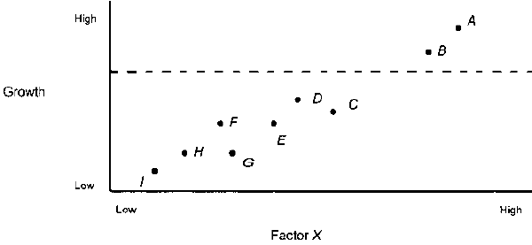
</div>

## Different types of selections

<div style="float: left; width: 50%;">
### Selection on IV
<div class="centered">
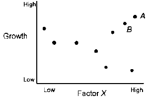
</div>

</div>


<div style="float: right; width: 50%;">
### Selection on DV
<div class="centered">
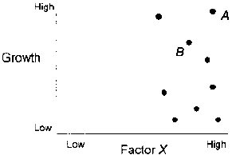
</div>

</div>

----

### Selection on Both
<div class="centered">
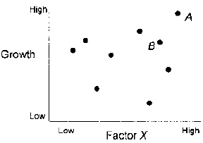
</div>


## The consequence of selection bias

* When your case study suffers from selection bias, <br><br><div class="centered">
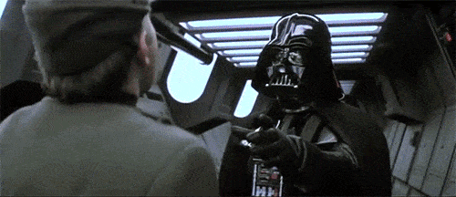
</div>

* Any characteristics that the selected cases share is a cause.
* The relations between variables within the selected set reflect a general pattern.

## Example
* Question: Why new industrializing countries (NICs) grows more rapidly?
* Theory: The repression of labor

----

* Case: <div class="centered">
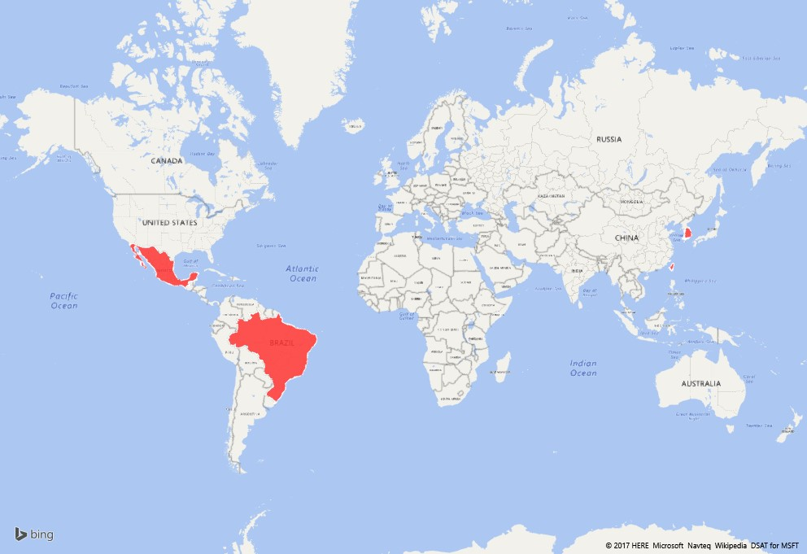
</div>

* What type of design this is?

## What's the problem?

<div class="centered">

</div>

## When selection is not a problem

* Theory-oriented
    + Labor repression contributes to growth in a at least mixed economy
    + Case selection: Communist countries are excluded.
* Hypothesis-oriented
    + Theory: Military governments are more likely to negotiate their extrication from power
than are personalist regimes.
    + Hypothesis: Incidence of negotiation in military governments during the years in which breakdown occurs is higher than that in personalist regimes.
    + Case selection: Only breakdown regimes are select.
    
## Avoid selection bias (when it's possible)

* Being clear about the domain of the variables
* Coding sheet

## Example from Skocpol

<div class="centered">
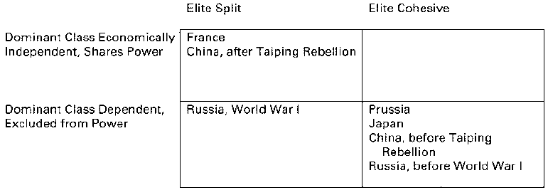
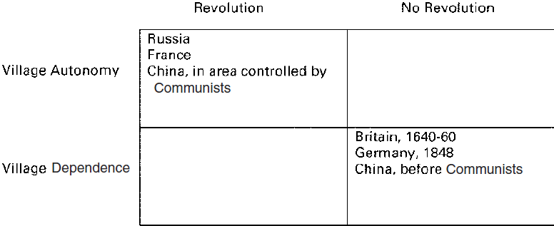
</div>

## Ask a correct question

* "What was the effect of cause X?" $\checkmark$
* "What cause Y?" or "Variance of the effect of X?" $\times$

# Toolbox of case study

## Least-likely case

<div class="centered">

</div>

* If the theory can make it here, it can make it anywhere.

----

* E.g.: Evangelista(1999)
    + Target: Influence of transnational actor
    + Theory: Transnational actor can affect international relations
    + Case: U.S. vs. USSR
        + Scientists' contact affect the course of U.S. and Soviet defense and arm control policies.


## Most similiar systems

<div class="centered">
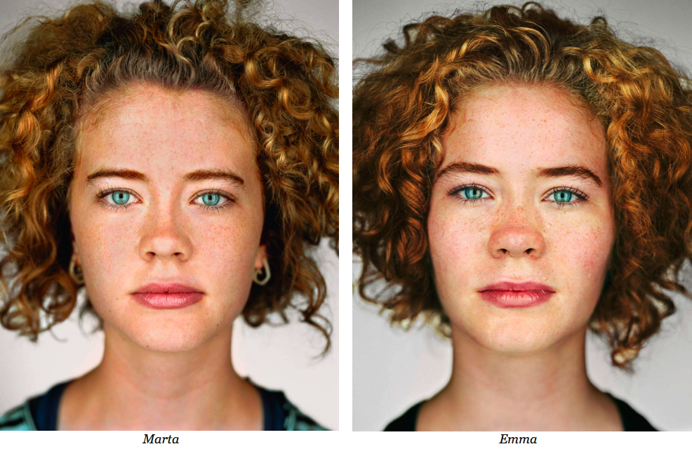
</div>

* Control similarity, focus on differences.

----

* E.g.: Ray(1995)
    + Target: Interstate conflicts
    + Theory: Democratic peace
    + Case: UK-France Fashoda Crisis vs. Spanish-American War
        + Control for confounders (regression effects, mortality, selection bias) and same year
        + Explanatory: regime
        
## Deviant Cases

<div class="centered">
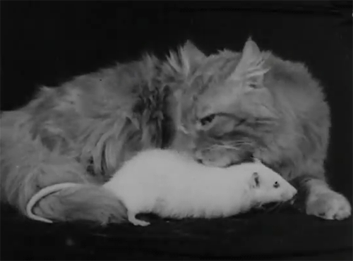
</div>

* Cases that do not conform to the predictions made by the theory or theories under investigation.

----

* E.g.: Elman(1997)
    + Theory: Democratic peace
    + Case: Finland vs. UK in the Continuation War
        + Finland: Legislature does not balance president
    + Conclusion: decentralized vs. centralized democracies
    
## Process tracing

<div class="centered">
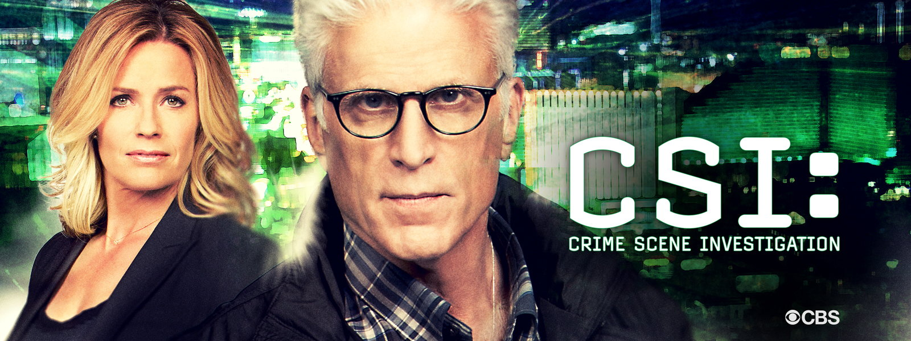
</div>

* Explicit attention to and process tracing on alternative explanations
* Sustained focus on the question of "what else must be true" of the process
* A wide variety of sources