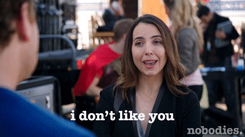
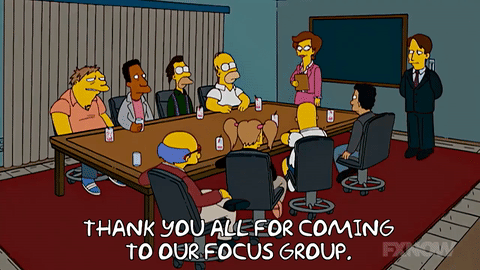
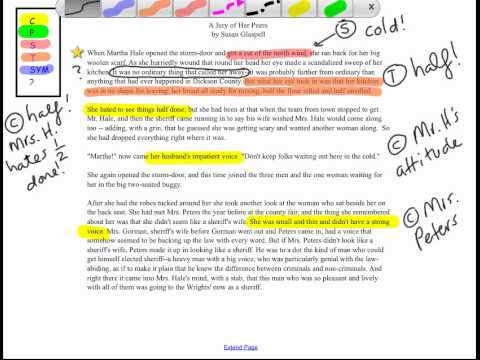
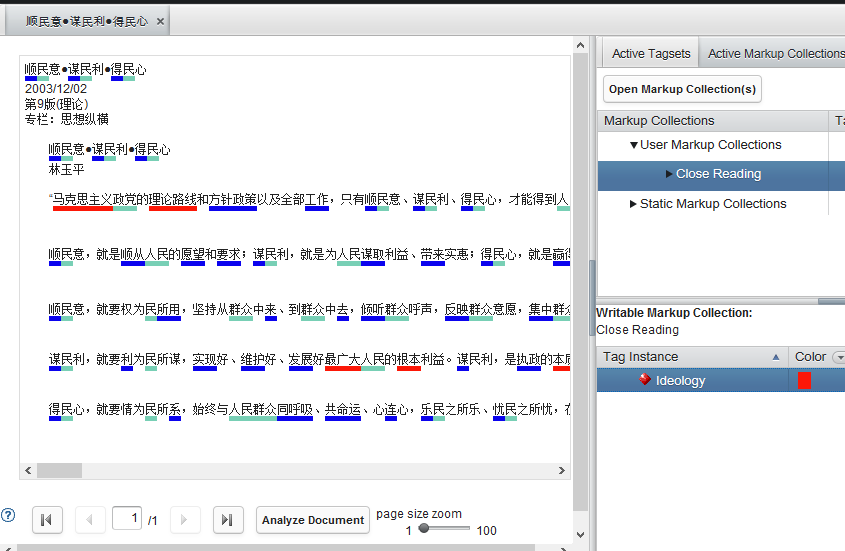
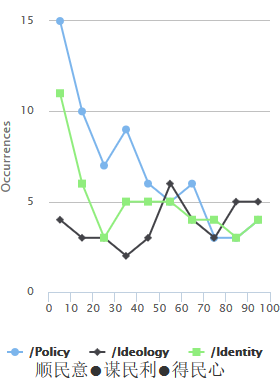
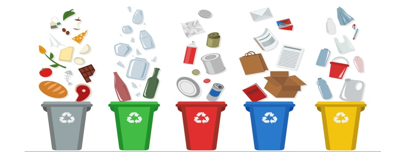

```{r setup, include = FALSE}
knitr::opts_chunk$set(echo = FALSE, message = FALSE, warning = FALSE)

library(pacman)
p_load(dotwhisker, ggplot2, interplot, # Visualization
       RefManageR, emo,# Applied
       knitr, kableExtra, # dependency
       readxl, haven, descr, stringi, stringr, arm, car, stargazer, data.table,
       broom, tidyverse) # data wrangling

set.seed(313)
```

## Interview

<div class="centered">

</div>

* Goal: Collective information
* Method: Strategic communication (guiding and listening)

----

<div style="float: left; width: 40%;">
* Outcome: 
    + Open answers
    + Messy details
    + Contradictory points
    
* Technique
    + Safe environment
    + More listening, less talking
    + Design the interview strategy + pilots

</div>

<div style="float: right; width: 60%;">
* Be prepared<br><br><div class="centered">

</div>
</div>

## Interview 2.0: Focus Group

<div class="centered">

</div>

----

<div style="float: left; width: 50%;">

### Design
1. Size: 5--15
1. Subjects read or watch something.
1. Researcher ask the questions.
1. Subjects express the feelings and opinions.

</div>

<div style="float: right; width: 50%;">
### Pros:

1. Real-life environment
1. Flexibility
1. Low cost


### Cons:

1. Non-privacy-protection
1. Who lead the talk?
1. No SUTVA
1. Selection interviewees

</div>

## Content analysis

<div class="centered">

</div>

## Content Sampling

* Terminology:
    + Content analysis: 100 and below
    + Text analysis: above 100 (usually above 1,000)
    + Unit of analysis?
* Sampling technique
    + Convenient sample
    + Stratification
    + Clustering
    
## Coding

* Manifest content
* Latent content
* Online assistance: [CATMA](http://catma.de/) or eMargin

## Example from CATMA

<div class="centered">

</div>

----

<div class="centered">

</div>


## When should you use?

### Pros

* Economy
* Allowing correction
* Overtime survey
* Third party

### Cons

* Limited content
* Limited scale
* Subjective consistency

# Qualitative Data Processing

## Coding

<div style="float: left; width: 30%;">
* Open coding<br><br><div class="centered">

</div>

</div>

<div style="float: right; width: 70%;">
* Axial coding<br><br><div class="centered">

</div>

</div>


----

* Selective coding<br><br><div class="centered">

</div>


## Lab notes

Keep records!!

* Code notes
* Theoretical notes
* Operational notes

## Let computer help you!

<div class="centered">

</div>
