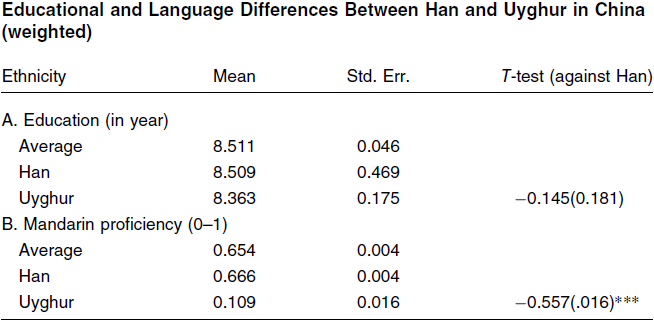
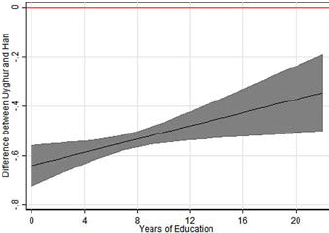
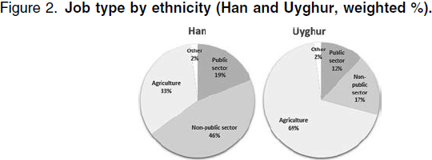
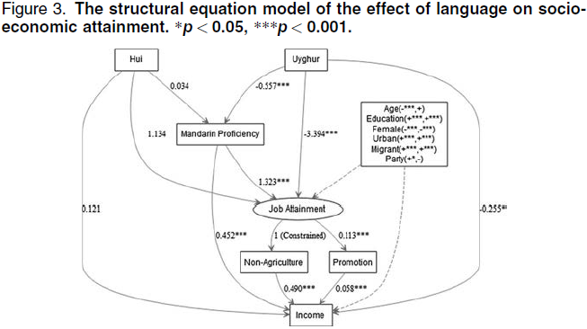
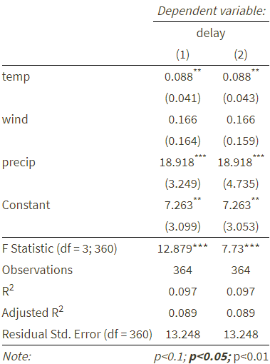

```{r setup, include = FALSE}
knitr::opts_chunk$set(echo = FALSE, message = FALSE, warning = FALSE)

library(pacman)
p_load(dotwhisker, interplot, # Visualization
       RefManageR, emo,# Applied
       knitr, kableExtra, # dependency
       readxl, haven, descr, stringi, stringr, arm,broom, tidyverse) # data wrangling

set.seed(313)
```

# Welcome to the large-N world!
## How large is a Large-N N?

Let's revisit the toss of coin:

* Tossing once? Head or Tail?<br><br><div class="centered">

</div>


----

Tossing 1 million times? How many heads?

* <div class="centered">

</div>

## Law of Large numbers

As the number of experiments (sample) increases, the ratio of outcomes will converge to the theoretical (population) average.

* Rule of thumb: $> 100$

## How to analyze large-N data?

* Univariate analysis
* Bivariate analysis
* Multivariate analysis

## Univariate analysis

How can we describe a variable?

* Creating the expectation of a variable
    + Given a list: $(1, 1, 1, 2, 3, 3, 4)$
    + Mean: $\frac{1 + 1 + 1 + 2 + 3 + 3 + 4}{7} = \frac{15}{7} \approx 2.143.$
    + Median: 1, 1, 1, <span style="color:red">**2**</span>, 3, 3, 4
    + Mode: </span>three 1s</span>, one 2, two 3s, and one 4.

## Example in large-N data

```{r fig.align="center"}
df_var <- data.frame(x = sample(1:10, size = 100, replace = TRUE))

ggplot(data = df_var, aes(x)) +
  geom_bar() +
  ylab("") + xlab("") +
  scale_x_discrete(limit = 1:10) +
  geom_vline(xintercept = as.numeric(c(mean(df_var$x), 
                            names(sort(-table(df_var$x)))[1],
                            median(df_var$x))), color = 1:3) +
  annotate("text", x = 2, y = 12, label = "Mode") + 
  annotate("text", x = 5, y = 11, label = "Mean") +
  annotate("text", x = 6.5, y = 13, label = "Median")
```

## Which one should we choose?

```{r distribution, fig.align='center'}
df_var <- data.frame(x = rnorm(10000, mean = 0, sd = 1),
                     y = c(rbeta(9900, shape1 = 5, shape2 = 2), rep(1.5, 100)),
                     z = rnorm(10000, mean = 10, sd = 1),
                     w = rbinom(10000, 1, .5)) %>%
                       mutate(z = w * x + (1 - w) * z) %>%
                         select(x, y, z) %>%
                           gather(var, value)

ggplot(df_var, aes(value)) +
  geom_histogram() +
  facet_wrap(~ var, scales = "free") +
  xlab("") + ylab("")
```


## Moments of a variable

Mean: $\mu_x = \frac{\sum X_i}{N};$ Variance: $\sigma^2_x = E[(X - \mu_x)^2].$

```{r meanVariance, fig.align='center'}
ggplot(data = data.frame(x = c(-5, 5)), aes(x)) +
  stat_function(colour = "red", fun = dnorm, n = 101, args = list(mean = 0, sd = 1)) + 
  stat_function(colour = "blue", fun = dnorm, n = 101, args = list(mean = 0.5, sd = 1.5)) +
  ylab("") + xlab("") +
  geom_vline(xintercept = 0, linetype = "dashed", color = "red") +
  geom_vline(xintercept = 0.5, linetype = "dashed", color = "blue") +
  annotate("text", x = -1.2, y = .35, label = "Mean = 0\n SD = 1") + 
  annotate("text", x = 2.5, y = .2, label = "Mean = 0\n SD = 1.5")
```

----


Skewness: $\gamma_x = E[(\frac{X - \mu_x}{\sigma})^3].$


```{r skewness, fig.align='center'}
ggplot(data = data.frame(x = c(-.5, 1.5)), aes(x)) +
  stat_function(colour = "red", fun = dbeta, n = 101, args = list(shape1 = 5, shape2 = 2)) + 
  stat_function(colour = "blue", fun = dbeta, n = 101, args = list(shape1 = 2, shape2 = 5)) +
  ylab("") + xlab("") +
  annotate("text", x = -0.125, y = 1.5, label = "Right skewed") + 
  annotate("text", x = 1.125, y = 1.5, label = "Left skewed")
```

----

Kurtosis: $\kappa_x = E[(\frac{X - \mu_X}{\sigma})^4].$

```{r kurtosis, fig.align='center'}
ggplot(data = data.frame(x = c(-5, 5)), aes(x)) +
  stat_function(colour = "darkgreen", fun = dnorm, n = 101, args = list(mean = 0, sd = .5)) + 
  stat_function(colour = "red", fun = dnorm, n = 101, args = list(mean = 0, sd = 1)) + 
  stat_function(colour = "blue", fun = dnorm, n = 101, args = list(mean = 0, sd = 2)) +
  ylab("") + xlab("") +
  annotate("text", x = 1.2, y = .6, label = "Leptokurtic") +
  annotate("text", x = 2.25, y = .3, label = "Mesokurtic (Normal)") + 
  annotate("text", x = 3.5, y = .1, label = "Platykurtic")
```

## Descriptive Statistics

```{r descTable, results='asis'}
knitr::kable(t(summary(select(mtcars, am, carb, cyl, gear,vs))))
```


## Even better...

```{r descriptive, fig.align='center'}
df_desc <- select(mtcars, am, carb, cyl, gear,vs) %>% # select the variables
  gather(var, value) # reshape the wide data to long data

ggplot(data = df_desc, aes(x = as.factor(value))) + geom_bar() + 
  facet_wrap(~ var, scales = "free", ncol = 3) + xlab("")
```

## How to describe a relationship?{.smaller}

Contingency table:

```{r}
CrossTable(mtcars$gear, mtcars$cyl, prop.chisq = FALSE, prop.c = FALSE, prop.r = FALSE)
```

## Scatter plot

```{r}
ggplot(mtcars, aes(wt, mpg)) +
  geom_point() +
  ylab("Miles/(US) gallon") +
  xlab("Weight (1000 lbs)")
```

# Do a multivariate analysis
## Example: Tang, Hu, and Jin (2016)

Puzzle: Same education level, but difference in labor mobility between Han and Uyghur

<div style="float: left; width: 50%;">
<div class="centered">

</div>

</div>


<div style="float: right; width: 50%;">
<div class="centered">

</div>

</div>


## Theory

Affirmative inaction language policy reduces Uyghurs' labor mobility.

<div class="centered">

</div>


## Hypothesis: 
* $H_1$: Education is fairly equal between the Han and the Uyghur groups.
* $H_2$: The linguistically distinctive Uyghurs are far less proficient in Mandarin than the Han majority.
* $H_3$: Hans enjoy a higher degree of socioeconomic status than the Uyghurs.
* $H_4$: Language proficiency plays a favorable role in improving the socioeconomic conditions for the Uyghurs.
    
## Examination

$H_{1,2}$: Education is fairly equal between the Han and the Uyghur groups.

<div class="centered">

</div>

----

$H_2$: The linguistically distinctive Uyghurs are far less proficient in Mandarin than the Han majority.

<div class="centered">

</div>

----

$H_3$: Hans enjoy a higher labor mobility than the Uyghurs.

<div class="centered">

</div>

----

$H_4$: Language proficiency plays a favorable role in improving the socioeconomic conditions for the Uyghurs.

<div class="centered">

</div>

## Wrap up

<div style="float: left; width: 50%;">

### Understand Large-N Analysis

<div class="centered">

</div>

</div>


<div style="float: right; width: 50%;">

### Do large-N analyses

* Elaborate the puzzle
* Set up the theory
* Imply hypotheses
* Design empirical examination
* Data analysis
* Result discussion

</div>