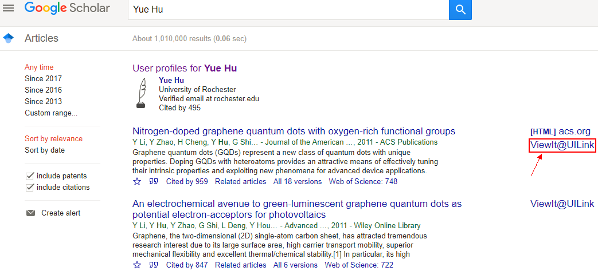
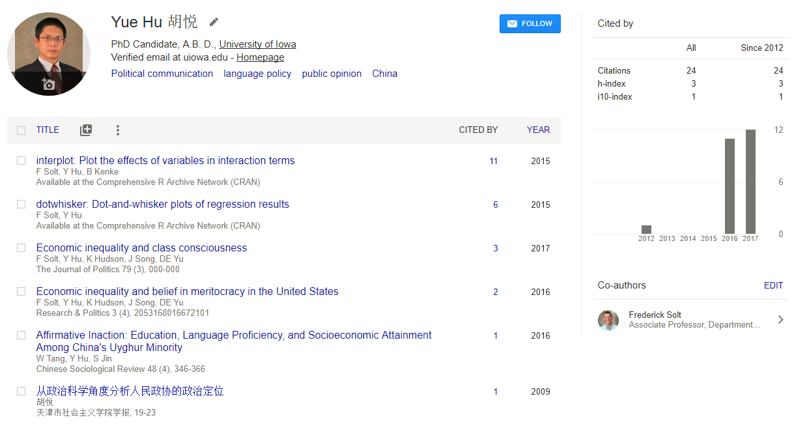
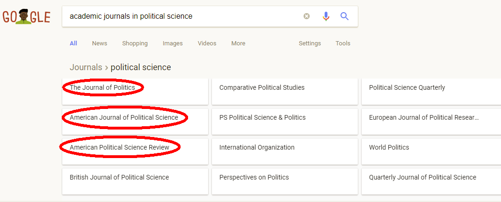
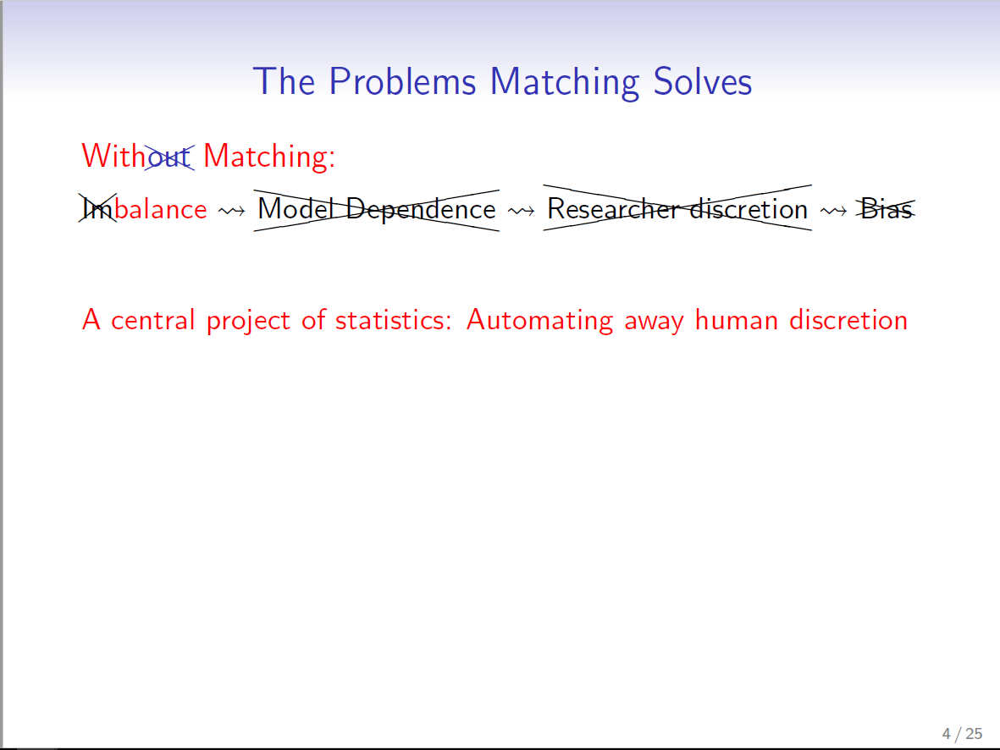
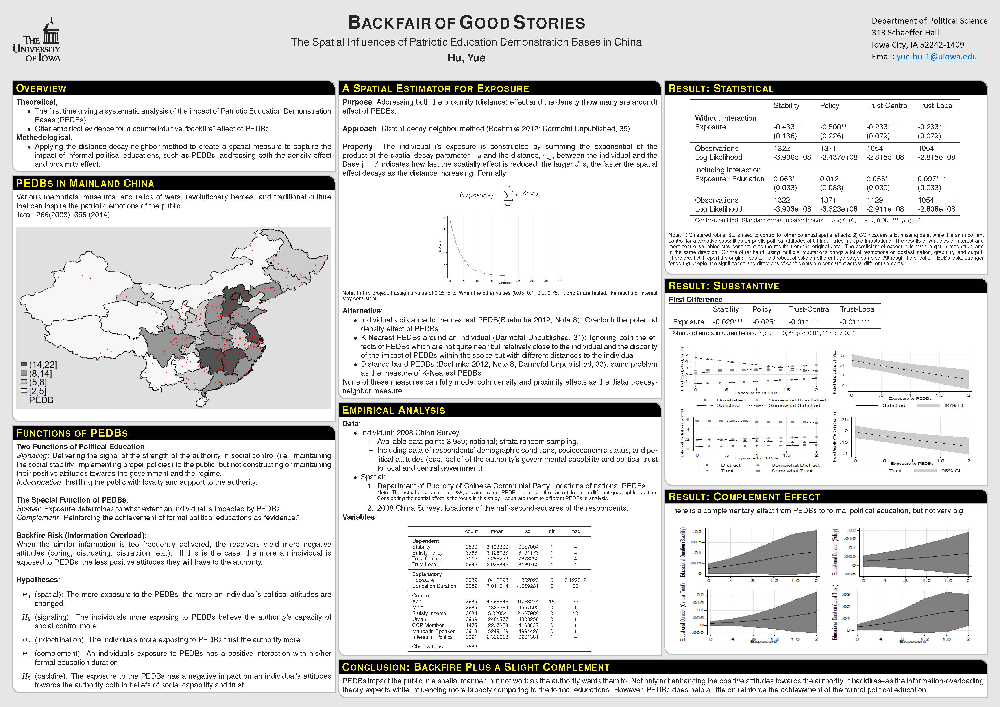

```{r setup, include = FALSE}
knitr::opts_chunk$set(echo = FALSE, message = FALSE, warning = FALSE)

library(pacman)
p_load(dotwhisker, interplot, # Visualization
       RefManageR, emo,# Applied
       knitr, kableExtra, # dependency
       readxl, haven, descr, stringi, stringr, arm,broom, tidyverse) # data wrangling

set.seed(313)
```

# How to do literature research

## Where to find the established research?

<div style="float: left; width: 50%;">
* Legit sources:
    + Not Wikipedia
    + Not CNN or FOX
    + Not Twitter
    <br><br>
    + Books (research monograph)
    + Academic Journal Articles

</div>


<div style="float: right; width: 50%;">

* Where to find it? 
    + <div class="centered"></div>
    + <div class="centered"></div>

</div>

## Using google scholar with library access

<div class="centered">

</div>

----

<div class="centered">

</div>

----

<div class="centered">

</div>

----

<div class="centered">

</div>


----

<div class="centered">

</div>


# How to write a paper?

## General tips

* Using section titles.
* Don't be too long (20--25 pages).
* Don't over-quoting.
* Again, playing as a lawyer rather than a detective or story teller!

## Introduction (1--2 pages)

* <span style="color:red">**Most**</span> important part 
    + Research question
    + Importance
    + Theory in <span style="color:purple">brief</span>
    + Method in <span style="color:purple">brief</span>
    + Findings in <span style="color:purple">brief</span>
    + So what?

## Literature Review (2--3 pages)

<div style="float: left; width: 50%;">

<div class="centered">

</div>

</div>


<div style="float: right; width: 50%;">

* Short! Short! Short!
* Organized & generalized
* Contribution rather than findings
* More than three citations

</div>


## PLAGIARISM{.smaller}

* Easier than you think, even unintentionally!
* In text: 
    + Hu(2012, 15--36) finds that the literature in this area is well developed (King 2007). 
* Bibliography: (Details in this [link](http://www.apsanet.org/APSR-Submission-Guidelines))
    + Books: Ahlquist, John S. and Margaret Levi. 2013. In the Interest of Others: Leaders, Governance, and Political Activism in Membership Organizations. Princeton: Princeton University Press.
    + Periodicals: Gerring, John. 2005a. "Causation: A Unified Framework for the Social Sciences." Journal of Theoretical Politics 17:2 (April):163-98.
    + Chapter in Edited Collection: Brady, Henry E. and Cynthia S. Kaplan. 2011. "Conceptualizing and Measuring Ethnic Identity." In Measuring Identity: A Guide for Social Scientists, eds. Rawi Abdelal, Yoshiko M. Herrera, Alastair Iain Johnston, and Rose McDermott. New York: Cambridge University Press, 33-71.
    + Web Sites: American Political Science Association. 2013. "About the APSA Africa Workshops." Washington, DC: American Political Science Association. Retrieved October 10, 2013 (http://www.apsanet.org/~africaworkshops/content_58417.cfm).

## Theory (3--5 pages)

<div style="float: left; width: 50%;">

<div class="centered">

</div>

</div>


<div style="float: right; width: 50%;">

* Definition
    + Dependent variable(s)
    + Independent variable(s)
* Clear relationship
* Hypotheses!!

</div>


## Research Design (5--8 pages)


<div style="float: left; width: 50%;">

<div class="centered">

</div>

</div>


<div style="float: right; width: 50%;">

* Plan of collecting data
    + Validation of the data selection
* Plan of using data
    + Justification of method choice
* Feasibility of research design
<br><br>

* So far, research proposal

</div>

## Finishing

<div style="float: left; width: 50%;">

### Results (4--6 pages)

* Empirics
* Findings

</div>


<div style="float: right; width: 50%;">

### Conclusion (1--2 pages)

* Most important findings
* Implications of the findings

</div>


# How to do academic presentation?

## Preparation

* Oral
    + 10 slides for 15 mins
    + Two-page long manuscript
    + Mental set
* Poster
    + 7--8 sections
    + An elevator speech (3--5 mins)

## Slides

<div class="centered">

</div>

----

<div style="float: left; width: 60%;">

<div class="centered">

</div>

</div>


<div style="float: right; width: 40%;">

* 5-5-5 Rule (?)
    + no more than five words per line of text, five lines of text per slide, and five text-heavy slides in a row
    
* Tips
    + Clean background
    + Colorful contents
    + Explicit discussion

</div>


## Poster

<div class="centered">

</div>

## Presenting

* Professionally dressed
* Being a teacher
* Rehearsal
* Prepare for Q&A

## Example

<iframe width="560" height="315" src="https://www.youtube.com/embed/I_LYh4Tb9Q0?list=PLGoANLi6OAlBBxrkbDZ1stH5Al98r8MOc?ecver=1" frameborder="0" gesture="media" allowfullscreen></iframe>

# You're done!

<div class="centered">

</div>