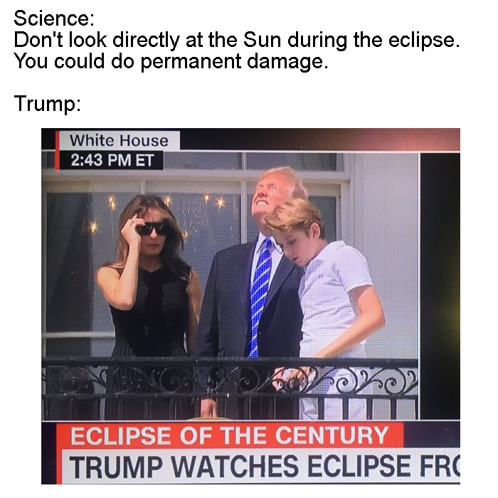
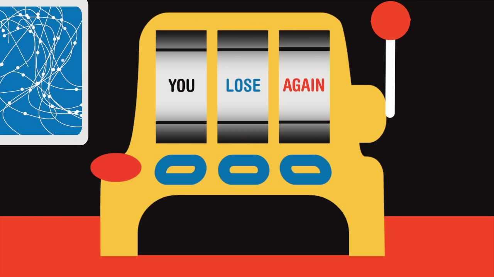
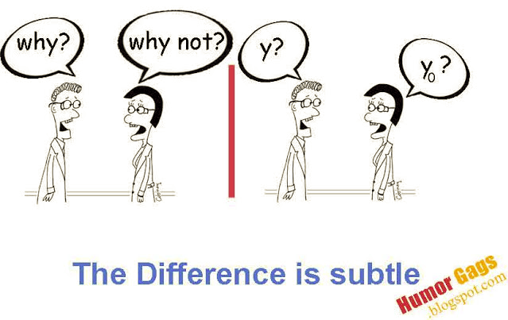
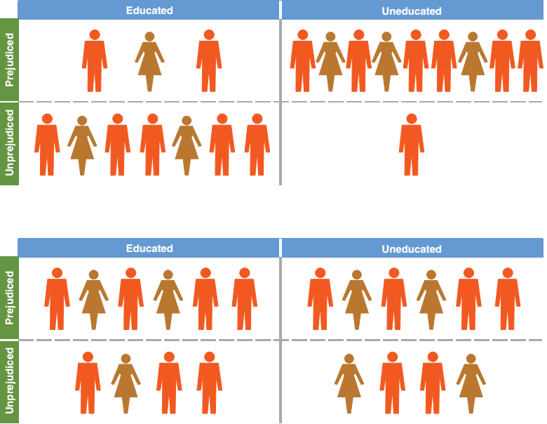
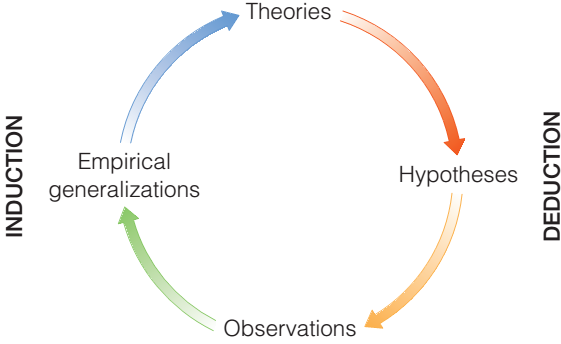
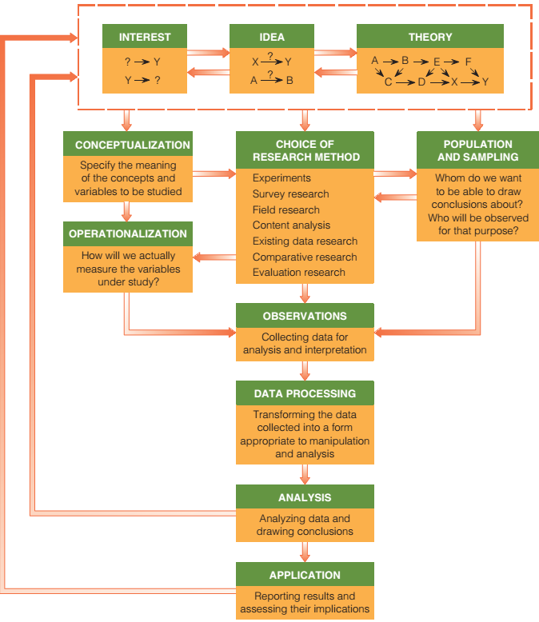
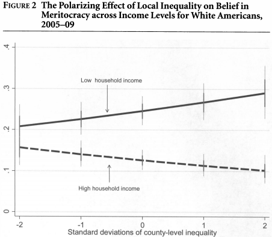
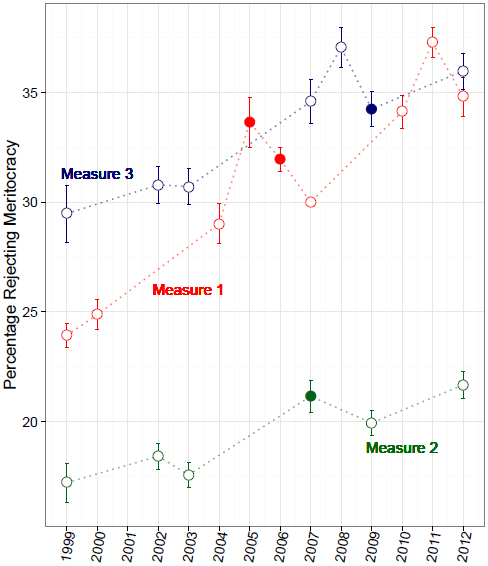
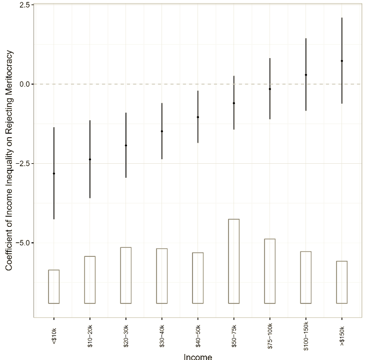
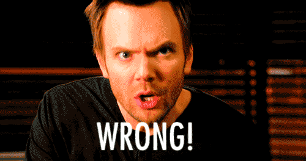

<style>
div#before-column p.forceBreak {
    break-before: column;
}
div#after-column p.forceBreak {
    break-after: column;
}
</style>

```{r setup, include = FALSE}
knitr::opts_chunk$set(echo = FALSE, message = FALSE, warning = FALSE, fig.pos = '!h')

library(pacman)
p_load(dotwhisker, ggplot2, interplot, # Visualization
       RefManageR, emo,# Applied
       # dependency
       readxl, haven, descr, stringi, stringr, arm, car, stargazer, data.table,
       broom, tidyverse) # data wrangling

set.seed(313)
```

# Social Scientific Inquiry

## If no scientific inquiry, how do you know
* Is this guy eatable?<br><br><div class="centered">

</div>

----

We observe<br><br><div class="centered">

</div>

----

How about this one?<br><br><div class="centered">

</div>


## Direct and Indirect Inquiries
* Inquiry
    + Observation
    + Agreement reality
        + Those things we "know" as part and parcel of the culture we share with those around us (Babbie 2016, 7)
* What's the relation between the two?

## Let's try another question:
* Is our president smart or not?
    + Observation<br><br><div class="centered">

</div>

----

Agreement Reality<br><br><div class="centered">

</div>

## Enough for a conclusion?

* But if we trace a longer story:
<iframe width="560" height="315" src="https://www.youtube.com/embed/h7XfH3XimXA?ecver=1" frameborder="0" allowfullscreen></iframe>

## Protential Problems of Human Inquiry

* Selection observation
* Inaccurate observation
* Overgeneralization

----

* Illogical Reasoning<br><br><div class="centered">

</div>

## How does social science avoid these isses?
* What question can be answered? Science vs. Philosophy<br><br><div class="centered">

</div>

----

<div class="centered">

</div>

Just a reminder, though.

## Target for social science
* What is?
* Why?
    + But why not "what should be"?
    
## Prerequisite
* Social regularities.
    + Patterns in social life
        + How can we sure about this?
            + Objections: Triviality, exception, human interfere
        + Who do social scientists focus?
            + Variable (independent? dependent?)
    
## How does it work?

<div class="centered">

</div>

## What do social science want to gain ultimately?{.columns-2}

* Three purpose
    + Exploration
    + Description
    + Explanation

* Two approaches
    + Inductive
    + Deductive
<br><br><br><br><br>
    
<p class="forceBreak">
* 
</p>

## Other choices
* Determinism vs. agency
* Qualitative vs. quantitative


# Roadmap and Shortcut

## Roadmap for social research

Three general steps:

1. Tell a story.
1. Characterize the roles in the story.
1. Match the story with the real life.


----

<div class="centered">

</div>


## Replication, replication
* Why should a project be replicable?
    + Transparency (?)


## Exception
* Qualitative research (?)
    + Not an exception
* Average score of this course?
* A survey on two people?
* A proprietary data?
* *Key criterion: releasing might hurt others*


## A qualified replication
* Replication dataset
* Publicly accessible
* Ways to do:
    + replication vs. reproduction (duplication vs. replication)
    + *Why are we worrying ourselves with what might be called "duplication"
of existing research? Isn't the more important question actual replication where the same measurements are applied to new substantive areas, countries, or time periods?*

## An Example: Expeirments on prisoner's dilemma

```{r results='asis'}
pri <- matrix(c("2,2", "3,0", "0,3", "1,1"), ncol = 2)
colnames(pri) <- rownames(pri) <- c("Quiet", "Fink")
library(xtable)
print(xtable(pri, align = "lrr"), type = "html")
```
<br><br>

* Rapoport, Guyer, and Gordon 1976: 
    + separate room; small number of times
    + 50%-94% choose fink.
* Deutsch 1958, Frank, Gilovich, and Regan 1993
    + face-to-face
    + 29% w. communication; 70% w/o communication

## Try yourself
Newman BJ, Johnston CD and Lown PL, "False consciousness or class awareness? Local income inequality, personal economic position, and belief in American meritocracy," *American Journal of Political Science* 59(2), 2015: 326–340.

<div class="centered">

</div>


## Components of the NJL paper {.smaller}

* Argument: Economic inequality reduces low-income people's belief in meritocracy.
    + Does it make sense?
    + Other ways to connect *inequality* and *meritocracy*?
    + Are they affected by a third variable.
* Dependent variable: *Disbelief* in meritocracy (survey question)
    + Can a survey measure meritocracy? 
    + What does meritocracy mean? Could that be something else?
* Independent variable: economic inequality (gini Coefficients) and rich-poor difference.
    + Other measurement of inequality
    + Does aggregate inequality measure individual feelings?
    + How to find the rich poor difference?
* Data source: 2005, 2007, 2009 Pew surveys.
    + Quantitative or qualitative?
    + 2005, 2007, 2009?

## A Real Reproduction

Frederick Solt, Yue Hu, Kevan Hudson, et al. “Economic Inequality and Belief in
Meritocracy in the United States”. Research and Politics 3.4 (2016), pp. 1-7.

1. **Replication**: Use the replication dataset offered by the authors to replicate the results
    + Partially failed.
1. **Reproduction**: 
    + Check all available datasets: 1999-2012 (hint: 2005, 2007, 2009 in the original paper)

----

<div class="centered">

</div>

## Reproduction continued
* Inequality on American dream: poor vs. rich
    + <div class="centered">

</div>

## Reproduction: conclusion
* Newman, Johnston, and Lown: Economic inequality <span style="color:yellow">reduces</span> low-income people's belief in meritocracy.
* Reproduction results: Economic inequality <span style="color:red">reinforces</span> low-income people's belief in meritocracy.
* <div class="centered">

</div>