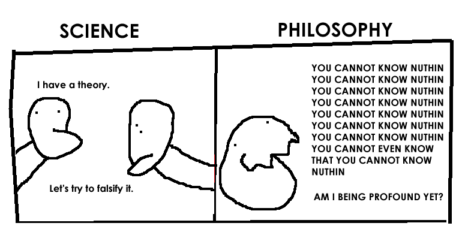

<style>
div#before-column p.forceBreak {
    break-before: column;
}
div#after-column p.forceBreak {
    break-after: column;
}
</style>

```{r setup, include = FALSE}
knitr::opts_chunk$set(echo = FALSE, message = FALSE, warning = FALSE, fig.pos = '!h')

library(pacman)
p_load(dotwhisker, ggplot2, interplot, # Visualization
       RefManageR, emo,# Applied
       # dependency
       readxl, haven, descr, stringi, stringr, arm, car, stargazer, data.table,
       broom, tidyverse) # data wrangling

set.seed(313)
```

# Social Scientific Inquiry

## In a world there's no science
* Is this guy eatable?<br><br><div class="centered">

</div>

----

We observe<br><br><div class="centered">

</div>

----

How about this one?<br><br><div class="centered">

</div>


## Direct and Indirect Inquiries
* Inquiry
    + Observation
    + Aggreement reality

<div class="notes">
<span style="color:red">Aggreement reality</span>: Those things we "know" as part and aprcel of the culture we share with those around us (Babbie 2016, 7). 
</div>

* What's the relation between the two?

## Let's try another question:
* Is our president smart or not?
    + Observation<br><br><div class="centered">

</div>

----

Aggreement Reality<br><br><div class="centered">

</div>

## Enough for a conclusion?

* But if we trace a longer story:
<iframe width="560" height="315" src="https://www.youtube.com/embed/h7XfH3XimXA?ecver=1" frameborder="0" allowfullscreen></iframe>

## Protential Problems of Human Inquiry

* Selection observation
* Inaccurate observation
* Overgeneralization

----

* Illogical Reasoning<br><br><div class="centered">

</div>

## How does social science avoid these isses?
* What question can be answered? Science vs. Philosophy<br><br><div class="centered">

</div>

----

<div class="centered">

</div>

Just a reminder, though.

## Target for social science
* What is?
* Why?
    + But why not "what should be"?
    
## Prerequisite
* Social regularities.
    + Patterns in social life
        + How can we sure about this?
            + Objections: Triviality, exception, human interfere
        + Who do social scientists focus?
            + Variable (independent? dependent?)
    
## How does it work?

<div class="centered">

</div>

## What do social science want to gain ultimately?{.columns-2}

* Three purpose
    + Exploration
    + Description
    + Explanation

* Two approaches
    + Inductive
    + Deductive
<br><br>
    
<p class="forceBreak">
* 
</p>

## Other choices
* Determinism vs. agency
* Qualitative vs. quantitative


# Roadmap and Shortcut

## Roadmap for social research

Three general steps:

1. Tell a story.
1. Characterize the roles in the story.
1. Match the story with the real life.

<div class="notes">

</div>


## Republication, republication
* Why should a project be republicable?
    + Transparency (?)
    + Future research (?)


## A qualified replication
* Replication dataset
* Publicly accessable
* Ways to do:
    + replication vs. reproduction (duplication vs. replication)

## Exception
* Qualitative research (?)
    + Not an exception
* Average score of this course?
* A survey on two people?
* A proprietary data?
* Key criterion: releasing might hurt others


## Again, why do we want to do so?
* Why are we worrying ourselves with what might be called "duplication"
of misting research? Isn't the more important question actual replication where the same measurements are applied to new substantive areas, countries, or time periods?

