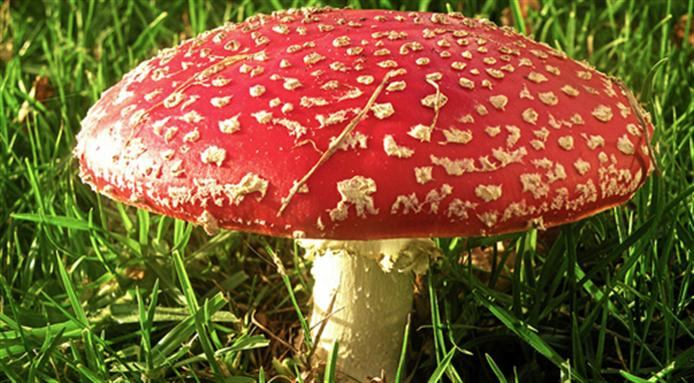

```{r setup, include = FALSE}
knitr::opts_chunk$set(echo = FALSE, message = FALSE, warning = FALSE, fig.pos = '!h')

library(pacman)
p_load(dotwhisker, ggplot2, interplot, # Visualization
       RefManageR, emo,# Applied
       # dependency
       readxl, haven, descr, stringi, stringr, arm, car, stargazer, data.table,
       broom, tidyverse) # data wrangling

set.seed(313)
```

# Social Scientific Inquiry

## In a world there's no science
* Is this guy eatable?<br><br><div class="centered">

</div>

----

We observe<br><br><div class="centered">

</div>

----

How about this one?<br><br><div class="centered">

</div>


## Direct and Indirect Inquiries
* Inquiry
    + Observation
    + Aggreement reality

<div class="notes">
<span style="color:red">Aggreement reality</span>: Those things we "know" as part and aprcel of the culture we share with those around us (Babbie 2016, 7). 
</div>

* What's the relation between the two?

## Let's try another question:
* Is our president smart or not?
    + Observation<br><br><div class="centered">

</div>

----

Aggreement Reality<br><br><div class="centered">

</div>

## Enough for a conclusion?

* But if we trace a longer story:
<iframe width="560" height="315" src="https://www.youtube.com/embed/h7XfH3XimXA?ecver=1" frameborder="0" allowfullscreen></iframe>

## Protential Problems of Human Inquiry

* Selection observation
* Inaccurate observation
* Overgeneralization

----

* Illogical Reasoning<br><br><div class="centered">

</div>

## How does social science avoid these isses?
* What question can be answered? Science vs. Philosophy<br><br><div class="centered">

</div>

----

<div class="centered">

</div>

Just a reminder, though.

## Target for social science
* What is?
* Why?
    + But why not "what should be"?
    
## Prerequisite
* Social regularities.
    + Patterns in social life
    + Source
* Objections:
    + Triviality (e.g., King et al. 2013)
    + Exception (e.g., Lakatos)
    + Human Interfere

# Replication, replication