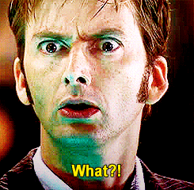
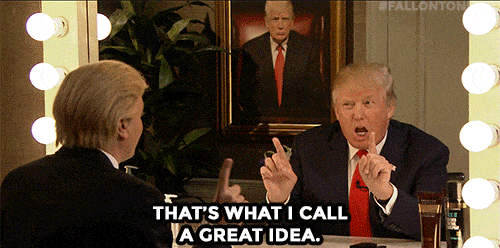

```{r setup, include = FALSE}
knitr::opts_chunk$set(echo = FALSE, message = FALSE, warning = FALSE)

library(pacman)
p_load(dotwhisker, ggplot2, interplot, # Visualization
       RefManageR, emo,# Applied
       # dependency
       readxl, haven, descr, stringi, stringr, arm, car, stargazer, data.table,
       broom, tidyverse) # data wrangling

set.seed(313)
```


## KKV's List{.smaller}

1. Choose a hypothesis seen as <span style="color:yellow">important</span> by scholars in the literature but for which <span style="color:yellow">no one</span> has completed a systematic study. ("literature"?)
1. Choose a hypothesis in the literature that we <span style="color:yellow">suspect</span> is been adequately confirmed and investigate whether it is indeed false.
1. Attempt to resolve or provide further  <span style="color:yellow">evidence of one side</span> of a controversy in the literature—perhaps demonstrate that the controversy was unfounded from the start.
1. Design research to illuminate or evaluate <span style="color:yellow">unquestioned assumptions</span> in the literature.
1. Argue that an important topic has been <span style="color:yellow">overlooked</span> in the literature and then proceed to contribute a systematic study to the area.

* A question that
    + people care (and/or?)
    + has not been studied (and/or?)
    + the existing confirmation might be wrong (and/or?)
    + relates to one side (and/or?)
    + the premise is wrong (and/or?)
    + something is missing (and/or?)
    
## Why does Geddes feel they are useless?

<div style="float: left; width: 50%;">
"It assumes, however, that the relevant literature really does contain a considerable accumulation of theory and stylized facts." (Geddes 2010, 29)

* Why does this bother Geddes? (GT)
    + The literature contains only a little consensus.
    + Vague in definition and empirics.
    + Opinions rather than theory. 
</div>

<div style="float: right; width: 50%;">
* What's the dangers?
    + Lost the main points.<br><div class="centered"></div>
</div>
    
## So, Geddes suggested
* An intense but unfocused curiosity, intuition, or indignation (GT)
* Being creative: observation $\times$ conjecture
    + Model?


## When is the literature useful?

<div style="float: left; width: 50%;">
* Stimulus<br><br><div class="centered"></div>
</div>

<div style="float: right; width: 50%;">
* Expectation<br><br><div class="centered"></div>
</div>

## Why is inductive research useful?
* Inductive? 
    + prevailing?
    + Danger? 
        + Correlation is not causation.
* Analytic narratives
    + Tracing the mechanism
    + Focusing on the fundamental unit (contrary to Babbie?)
    + Next step?
        + Empirical evidence
        
## Example: Step 1. Question Hunting{.smaller}
"No bourgeois, no democracy" (1966, 418): The likelihood of democracy increases once the size of the bourgeoisie has passed a certain threshold.

* When
    + Democracies would not be expected to occur <span style="color:yellow">before</span> the industrial and commercial revolutions.

* Where
    + The establishment of democracies would be expected first in the countries that  <span style="color:yellow">industrialized</span> first.
    + Democracy would be less likely in countries in which wealth comes mainly from the  <span style="color:yellow">export</span> of mineral resources.
    + Democracy would be less likely in countries in which  <span style="color:yellow">foreigners or pariah capitalists</span> excluded from the political community own most enterprises.
    
* How
    + In the contemporary world, democracy would be more likely in  <span style="color:yellow">more industrialized</span> countries.
    + The likelihood of democracy would decline as  <span style="color:yellow">state ownership</span> of economic resources rose.

## Step 2. Research Strategy
* Big question to rigorous investigation
* One process at a time
* Research your question like cooking a dish<br><br><div class="centered"></div>

## Let's cook it

<div class="centered"></div>

## Dish: Authoritarinism transition

* Literature: cook book
    + Expectation: Transition are determined by the important groups
    + Stimulus: 
        + no cross-national study, no systematic comparison
        + no complete process
* Narrow down (Simplification)
    + Key of transition: battles between winning and losing groups
    + How? 
        + Bargaining and negotiation
        + Overtime, multiparty
    + Why?
        + Internal? External?

----

* One piece at a time:
    + The politics within authoritarian governments, that is, how political rivalries, policy disagreements, and bargaining within different kinds of authoritarian regimes affect the incentives of authoritarian rulers to liberalize.
        + Method requirement: comparison
* Build the theory:
    + Literature (again) in
        + Not important divisions within the regime
        + Officials wants to maintain in office
            + Get sufficient supports from the constituents
* Further narrow down
    + Different leaders, different interests.

## Wrap up
* A question with emotional response.
* Use the literature cautiously.
* One piece at a time.

## A practical way to identify a good question
* "Do you want to talk it with your friends?"<br><br><div class="centered"></div>