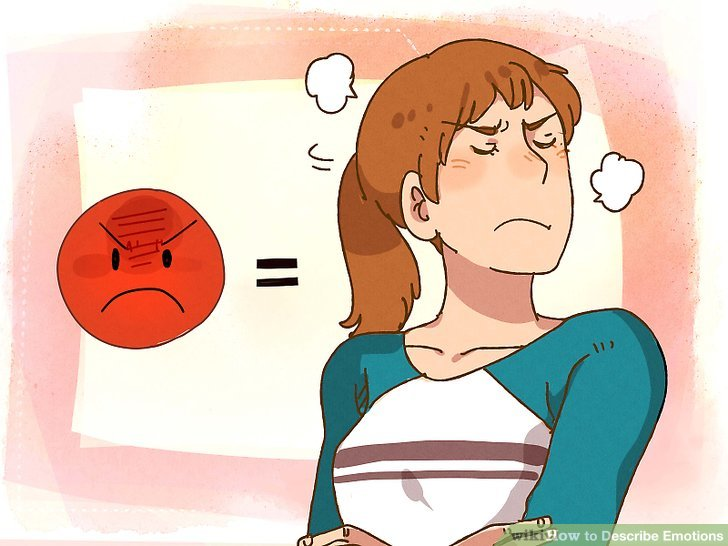
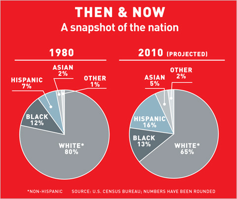
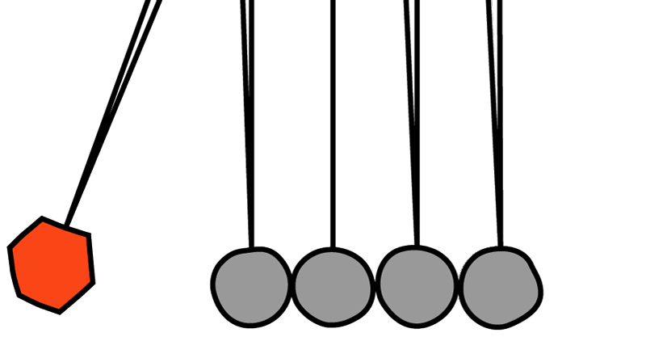
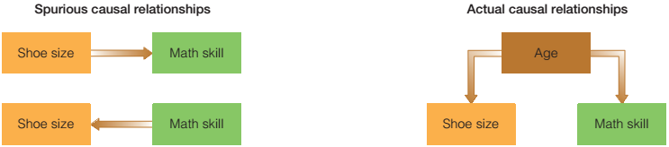
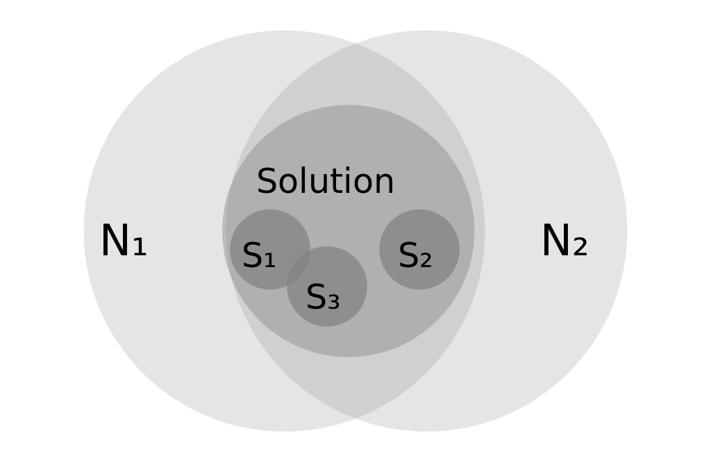
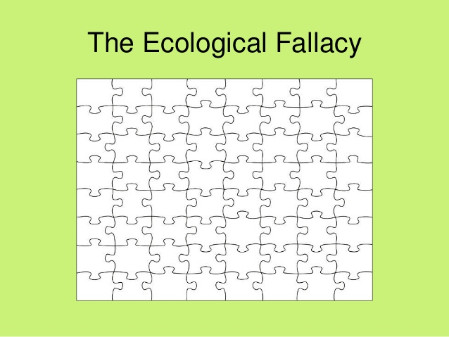

```{r setup, include = FALSE}
knitr::opts_chunk$set(echo = FALSE, message = FALSE, warning = FALSE)

library(pacman)
p_load(dotwhisker, ggplot2, interplot, # Visualization
       RefManageR, emo,# Applied
       # dependency
       readxl, haven, descr, stringi, stringr, arm, car, stargazer, data.table,
       broom, tidyverse) # data wrangling

set.seed(313)
```

# Quiz Time!! 


## Focus?
When you have a topic or question of interest, what can you do with it?

* Exploring
* Describing
* Explaining

## Exploration

<div class="centered">

</div>

* What to explore?
    + Satisfying curiosity.
    + Testing the feasibility of more works.
    + Developing methods.
* Weak points?

## Describing

<div class="centered">

</div>

## US Census

<div class="centered">

</div>

*GT: difference from exploration*

# Oh, Causality!
<div class="centered">

</div>


## Explanation in general
* Case-focused: Ideographic explanation
    + Complete, in-depth understanding of a single case
* Pattern-focused: Nomothetic explanation
    + Defence for causality

## Critera for nomothetic explanation

* The variables must be correlated.
* The cause takes place before the effect.
* The variables are nonspurious.

## Correlation
"An empirical relationship between two variables such that (1) changes in one are as- sociated with changes in the other, or (2) particular attributes of one variable are associated with particular attributes of the other." (Babbie 94)

```{r correlation, fig.height = 4, fig.align='center'}
dt_corr <- data.frame(x1 = sample(1:100, 100, replace = TRUE)) %>%
  mutate(x_high = x1 + rnorm(100, mean = 0, sd = 5),
         x_medium = x1 + rnorm(100, mean = 20, sd = 20),
         x_low = sample(1:100, 100, replace = TRUE)) %>%
           gather(key = "Correlation", value = "x2", 2:4) %>%
             mutate(Correlation = str_sub(Correlation,start = 3),
                    Correlation = factor(Correlation, levels = c("high", "medium", "low")))

ggplot(dt_corr, aes(x = x1, y = x2)) +
  geom_point() +
  facet_wrap(~ Correlation)
```

## So, if you have to dump someone...

<div class="centered">

</div>


## Time-order

<div class="centered">

</div>

## Spurious relationship

"A coincidental statistical correlation between two variables, shown to be caused by some third variable." (Babbie 94)

<div class="centered">

</div>

## Three false criteria

* Complete causation
* No exception
* Majority rule

## Complete causation

<div class="centered">

</div>

## Exception (probability)

<div class="centered">

</div>

## Majority rule

<div class="centered">

</div>

## Build your explanation with the right bricks

Unit of Analysis

<div class="centered">

</div>

## If you used the wrong bricks,...

<div class="centered">

</div>

## Reductionism

(Reductionist fallacy, individualist fallacy, exception fallacy)

An example:

* Hank: I ran my car off the side of the road because that damn squirrel ran in front of my car.
* Officer: You don't think it had anything to do with the fact that you were trying to text your girlfriend, and driving drunk?


## Beyond Causality

Ragin's purpose of soical research:

1. identifying patterns and relaitonships.
1. testing and refining theories.
1. making predictions
1. interpreting culturally and or historically significant phenomena
1. exploring diversity
1. giving voice
1. advancing new theories.

## Predicting

* What's prediting?
* Why is it important?
* What's the relation of this purpose with explanation?

(GT: 
1. someone said one can't say understand it if it cannot predict the future.
1. predicting rates is much easier.)


## Interpreting

Theda Skocpol (1979): *States and Social Revolutions*

* Surveying the revolutions in Russia, France, and China
* Two arguments:
    + Starting: crisis of state (international factor) + patterns of class domiance
    + Outcome: crisis + socioeconomic/international constrains
    
----

* Is Skocpol (1979) ideographic?
* How is this different from historian study? 
* How is this different from explanation?

## Giving voice

* Studies of gender rights
* Studies of environmentalism
* Studies of social media
* Studies of terrorism

# No research exists in vacuum!