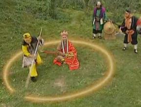
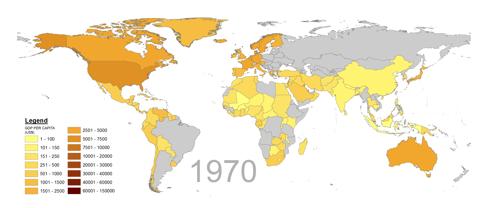
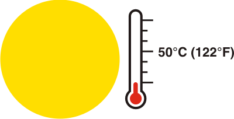
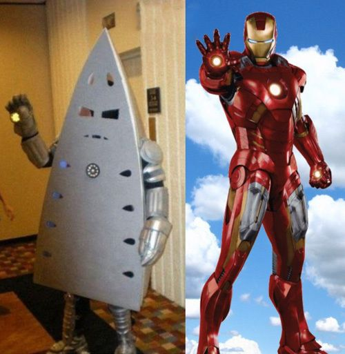
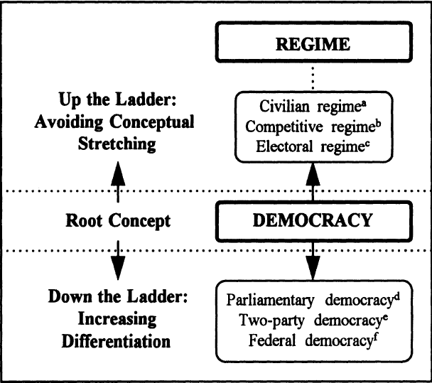
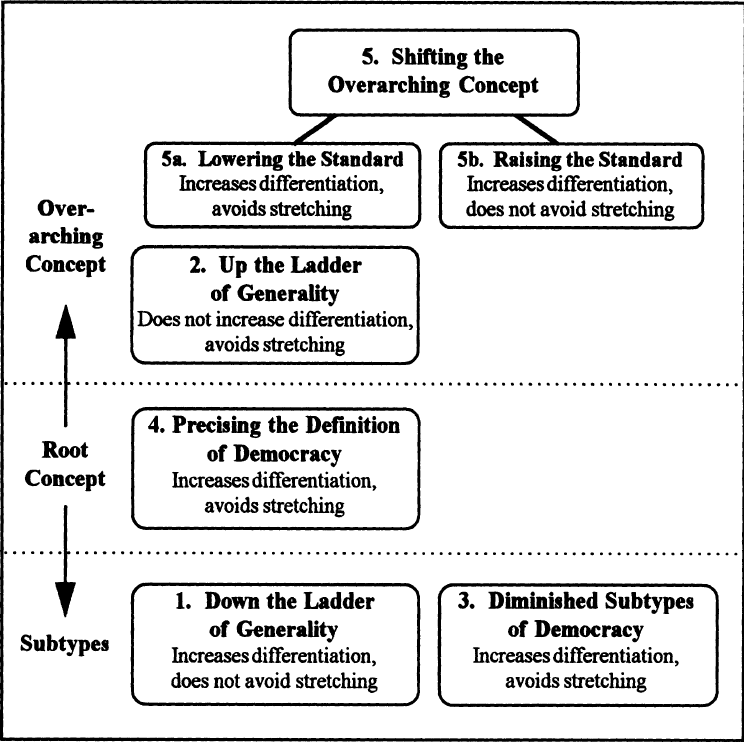

```{r setup, include = FALSE}
knitr::opts_chunk$set(echo = FALSE, message = FALSE, warning = FALSE)

library(pacman)
p_load(dotwhisker, ggplot2, interplot, # Visualization
       RefManageR, emo,# Applied
       # dependency
       readxl, haven, descr, stringi, stringr, arm, car, stargazer, data.table,
       broom, tidyverse) # data wrangling

set.seed(313)
```

## Why do we need conceptualization?

1. Description
1. Validation
1. Clarification<br><br><div class="centered">

</div>

## What's a valid concept?

* Component 1: Indicators
    + "A reflection of a variable we wish to study." (Babbie 128)
    + <div class="centered">

</div>

## Exercise I: Which one is an indicator?
<div class="centered">

</div>

## Exercise II: Which one is an indicator?

<div class="centered">

</div>

## Component 2: Dimension

* "A specifiable aspect" (Babbie 129)

<div style="float: left; width: 50%;">
* This?<br><br><div class="centered">

</div>
</div>

<div style="float: right; width: 50%;">
* Also this.<br><br><div class="centered">

</div>
</div>

## Exercise I: 

* Sour:

<div style="float: left; width: 50%;">
* pH scale: <br><br><div class="centered">

</div>
</div>

<div style="float: right; width: 50%;">
* Feeling: <br><br><div class="centered">

</div>
</div>

## Exercise II:

* Hotness

<div style="float: left; width: 50%;">
  * Temperature: <br><br><div class="centered">
  
  </div>
</div>

<div style="float: right; width: 50%;">
  * Taste: <br><br><div class="centered">
  
  </div>
</div>


## Of course,... 

* Face shape

<div style="float: left; width: 50%;">
* Hot <br><br><div class="centered">

</div>
</div>


<div style="float: right; width: 50%;">
* Not hot <br><br><div class="centered">

</div>
</div>

## Component 3: Mutually agreement

Does your definition make sense?<br><br>
<div class="centered">

</div>

## Invalid conceptualization: stretching

"When the concept of democracy is applied to cases for which, by relevant scholarly standards, it is not appropriate."

<div class="centered">

</div>


## Avoid stretching

* Sartori's ladder:
    + Defining attributes (*connotation*)
    + Applied cases (*extension*)
    + <div class="centered">

</div>

## Some techniques

<div style="float: left; width: 40%;">
* Compromise with the reality.
</div>


<div style="float: right; width: 60%;">
* <div class="centered">

</div>
</div>


## Let's try it

How to define "democracy" so that China can be included?

* Suffrage
* Contestation
* Civil liberties
* Elected government


