```{r setup, include = FALSE}
knitr::opts_chunk$set(echo = FALSE, message = FALSE, warning = FALSE)

library(pacman)
p_load(dotwhisker, ggplot2, interplot, # Visualization
       RefManageR, emo,# Applied
       # dependency
       readxl, haven, descr, stringi, stringr, arm, car, stargazer, data.table,
       broom, tidyverse) # data wrangling

set.seed(313)
```

## How do you measure the tourists' attitudes?

<iframe width="560" height="315" src="https://www.youtube.com/embed/7mItzFy-lUg" frameborder="0" allowfullscreen></iframe>

## Measure the attitudes in four levels:

* Nominal: "A nominal variable has attributes that are merely different, as distinguished from ordinal, interval, or ratio measures" (Babbie 139)<br><br><div class="centered">
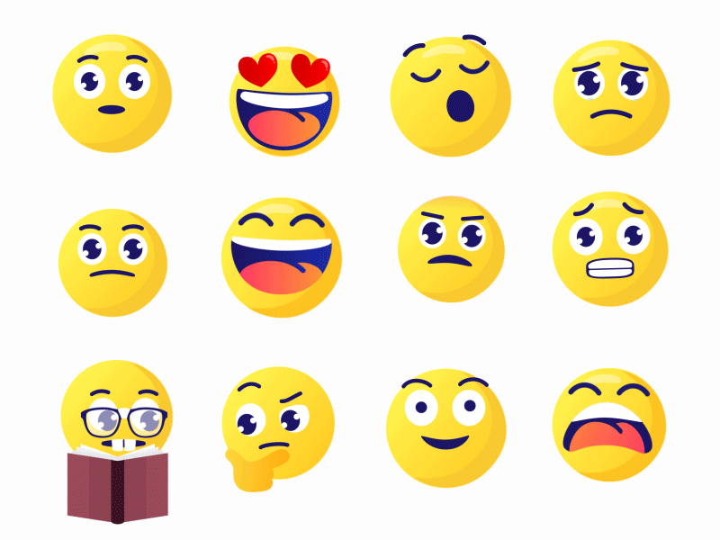
</div>
* Measure the Chinese tourists' attitudes with normal measurements?

## Ordinal

* "A level of measurement describing a variable with attributes we can rank- order along some dimension." (Babbie 140) <br><br><div class="centered">

</div>
* Measure the Chinese tourists' attitudes with normal measurements?

## Interval

* "A level of measurement describing a variable whose attributes are rank- ordered and have equal distances between adjacent attributes." (Babbie 140) <br><br><div class="centered">
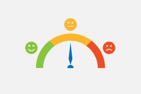
</div>
* Measure the Chinese tourists' attitudes with normal measurements?

## Ratio

* "The attributes composing a variable, besides having all the structural characteristics mentioned previously, are based on a true zero point. " (Babbie 140) <br><br><div class="centered">
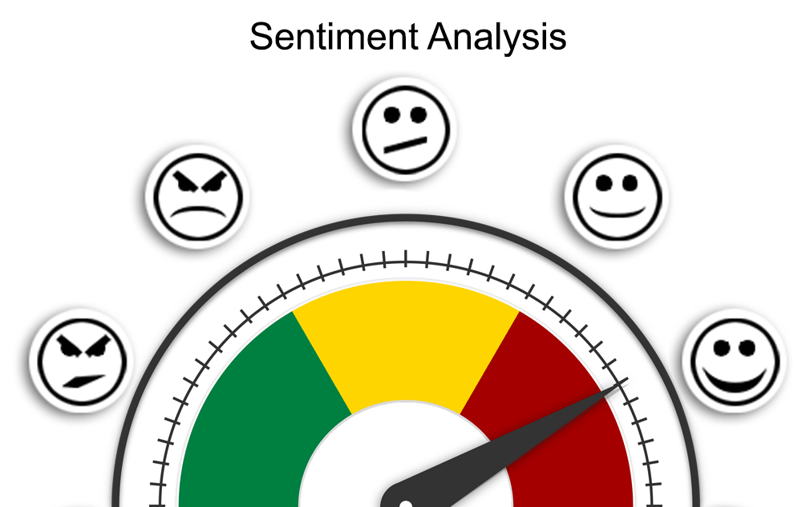
</div>
* Measure the Chinese tourists' attitudes with normal measurements?

## Assumption behand the measurement levels

<div class="centered">
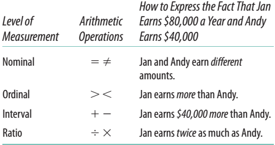
</div>

## Measurement Validation

* Precision
* Reliability
* Validity

## Precision

<div class="centered">
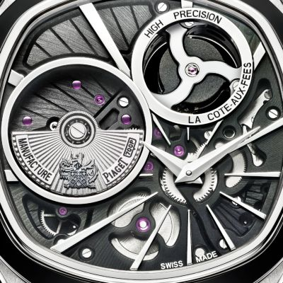
</div>

* Precision vs. reliability?

## Reliability

<div class="centered">

</div>

## Validity

"Valid measurement is achieved when scores (including the results of qualitative classification) meaningfully capture the ideas contained in the corresponding concept." (Adcock and Collier 2001, 530)

<div class="centered">

</div>

## Face validity

<div style="float: left; width: 50%;">
<div class="centered">
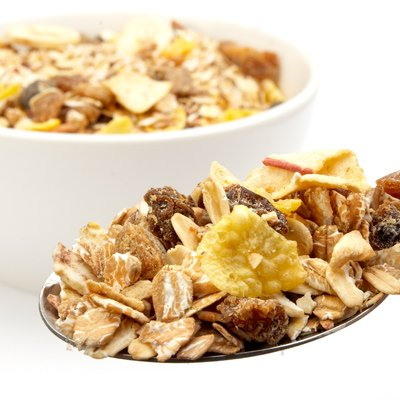
</div>
</div>

<div style="float: right; width: 50%;">
Microwave popcorn;   
Light salad dressings;   
Flavored fat-Free Yogurt;    
Dried Fruit;   
Blue corn chips;   
Cereal;   
......
</div>

## Precision, reliability, validity

<div class="centered">
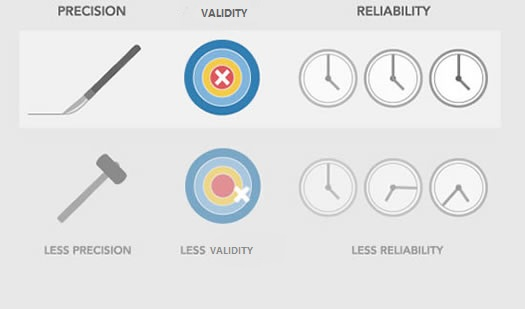
</div>

## Validity in depth

"Measurement is valid when the scores (level 4 in Figure 1), derived from a given indicator (level 3), can meaningfully be interpreted in terms of the systematized concept (level 2) that the indicator seeks to operationalize." (Adcock and Collier 2001, 531)

----

<div class="centered">
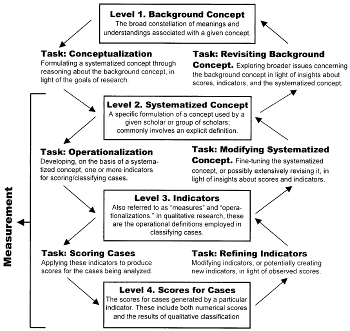
</div>

## Contextual specificity

"Do you like pizza?"

<div style="float: left; width: 50%;">
<div class="centered">
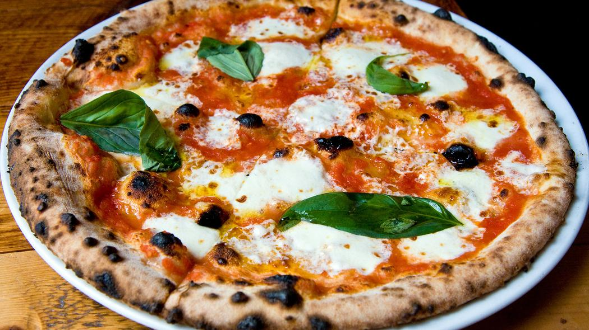
</div>
</div>

<div style="float: right; width: 50%;">
<div class="centered">

</div>
</div>

# How is a measurement looks like?

## Qualitative: Typology

<div class="centered">
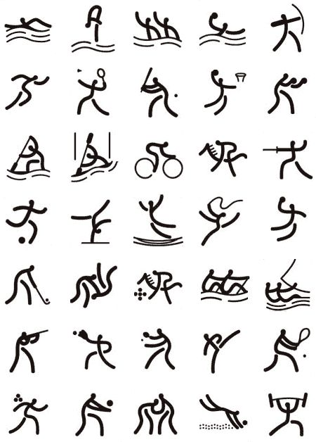
</div>

## Quantitative: Index vs. Scale

<div class="centered">
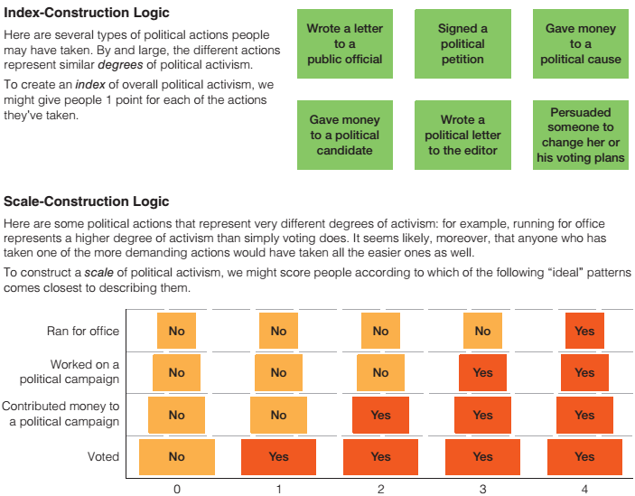
</div>