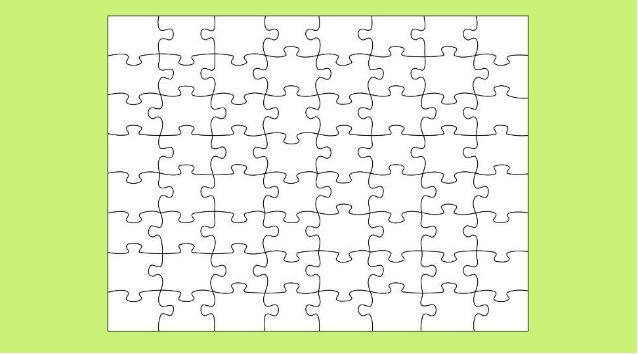

```{r setup, include = FALSE}
knitr::opts_chunk$set(echo = FALSE, message = FALSE, warning = FALSE)

library(pacman)
p_load(dotwhisker, ggplot2, interplot, # Visualization
       RefManageR, emo,# Applied
       # dependency
       readxl, haven, descr, stringi, stringr, arm, car, stargazer, data.table,
       broom, tidyverse) # data wrangling

set.seed(313)
```

## Traditions in Measure Democracy

* Level of measurement
* Structural equation model with latent variables
* Pragmatic
* Case-based

## Level of measurement

* Method: Guttman scaling
    + Each component is a binary (or more complicate) question.
        + "Evaluation your Instructor":
            + Is your instructor handsome? (Yes/Sure/Indeed)
            + Is your instructor knowledgeable? (Certainly/Absolutely/Definitely)
            + Do you feel he is the best instructor? (For sure/Of course/Oh,yeah)
    + The score is the accumulation of the components.

----

So, if your instructor get a score in 3 ~ 9, then you will know he is:

* <div class="centered">

</div> as he lets you to evaluate him as above.


## Example: Polity IV

* Coverage: 167 countries
* Period: 1800--2015
* Scoring:
    + Each state has two scores: autocracy vis-a-vis democracy
        + The competitiveness of political participation (1‐3)
        + The competitiveness of executive recruitment (1‐2)
        + The openness of executive recruitment (1)
        + The constraints on the chief executive (1‐4)
    + The components are added up as a "polity" score (-10 to 10) for each state.


## Concern about the LoM

* Some underlining assumptions:
    1. Adding up? Average? Multiple them? 
    1. Equal distance between scores.
    1. Experts?<br><br><div class="centered">

</div>

## SEM

```{r sem, fig.height=3}
DiagrammeR::grViz("
digraph democracy {

  # a 'graph' statement
  graph [overlap = true, fontsize = 20]

  # several 'node' statements
  node [shape = oval, fixedsize = false]
  a [label = 'Democracy']

  node [shape = box, fontname = Helvetica]
  b [label = 'Competitiveness of \npolitical participation'] 
  c [label = 'Competitiveness of \nexecutive recruitment'] 
  d [label = 'Openness of \nexecutive recruitment'] 
  e [label = 'Constraints on \nthe chief executive'] 
  

  # edge definitions with the node IDs
  a -> {b c d e}
}
")


```

Method: statistically seeking for the "latent" variable.

$$
\begin{aligned}
 Democracy &\sim \beta_a\mbox{Competitiveness of political participation}; \\
 Democracy &\sim \beta_b\mbox{Competitiveness of executive recruitment};\\
 Democracy &\sim \beta_c\mbox{Openness of executive recruitment};\\
 Democracy &\sim \beta_d\mbox{Constraints on the chief executive}.
\end{aligned}
$$

----

### Pros:
1. Brings together various variables
2. Focus directly on causal connections
3. Random error and bias
4. Reduce measurement errors

### Cons:
1. Intuitive (substantive) meaning?


## Pragmatic approach

Sensible rather than puristical measurements. 

* "In spite of all their conceptual and observational differences, the various approaches yield highly similar classifications of regimes. Hence, there is no reason to think that the results that follow depend on the particular way regimes were classified" Przeworski et al. (2000, 55)


* Issues: 
    + Ad hoc treatments of descriptive inference
    + A lack of systematic attention to measurement
    + Selection of measures 
    

## Case-based approach

* A book project + a deep yet narrow understanding
* Concern: Detail vs. Systematical<br><br><div class="centered">

</div>

## A ideal measurement

<div class="centered">

</div>

* But in practice:
    + Interests of time and space
    + At least a validation statement
    
# Midterm Review

## Question format

* Open-book

* Identification $\times$ 6 (30%)
* Interpretation $\times$ 2 (30%)
* Short essay $\times$ 2 (40%)

## Time distribution

75 mins in total.

* Identification: 25 min (2 ~ 5 min/question)
* Interpretation: 20 min (5 ~ 10 min/question)
* Short essay 30 min (10 ~ 15 min/question)


## Examples: Indentification

### Question

Explan the following term: Dependent variable

### Answer

Dependent variable is a variable assumed to depend on or be caused by the independent variable. (Babbie 18)


## Examples: Interpretation

### Question

What issue does the following image reflect?
Explain why this issue could be problemetic for social science researh.

<div class="centered">

</div>

----

### Answer (114 words)

The above image reflects an *ecological fallacy* issue. 
It happens when researchers erroneously drawing conclusions about individuals solely from the observation of groups (Babbie 103).


It could be problematic *because* the characteristics shown at the aggregate level of a group are not necessarily the characteristics of each individual in the group.
In this case, any estimation about the individuals at the group level could lead to a misleading conclusion. 


*As shown in the image*, each piece in this puzzle is irregular, but at the aggregate level, they compose a regular square. 
If one argues that each piece in the puzzle is a regular square because their composition is a square, this conclusion is invalid.


## Example: Short essay

### Question: 

Babbies discussed three fundamental purposes of social research.
What are they?
How do scholars design research for these goals?
Using political science examples to illustrate.

----

### Answer (317 words)

The three fundamental purposes Babbies discusses are exploration, description, and explanation.
Exploration *is* conducted to explore a topic, that is, to start to familiarize a researcher with that topic. 
This approach typically occurs when a researcher examines a new interest or when the subject of study itself is relatively new.

*An example* for exploratory research could be an observation of the populist trend in the U.S.
This research does not aim to provide a complete picture of the contemporary American public opinion trend or to examine any theory-based hypothesis or implication.
The only purpose is only to find out, for example, who are in this trend, what is the context that this trend occurs, and how influential this trend is.

Another major purpose of many social science studies is to describe situations and events. 
The researcher observes and then describes what was observed. 
In comparison to exploration and casual observations, descriptive research is usually more systematic, accurate, and precise.


----

### Answer (Continued)

An example of descriptive research is the Correlation of War (COW) project.
The project precisely records a series of data of every interstate conflicts in the modern history of human being, such as size, engaged parties, and duration.
The goal of the project is to describe accurately and precisely a wide variety of characteristics of interstate conflicts rather than testing any hypothesis.

The third purpose Babbie discusses is explanation.
Descriptive studies answer questions of what, where, when, and how;
explanatory questions, of why. 
It includes two types: ideographic explanation which seeks a complete, in-depth understanding of a single case and nomothetic explanation which focuses on the general patterns that can be used to explain a series of cases or phenomena. 

An example for explanatory research can be a study about why international organizations cannot eliminate interstate conflicts.
The researchers should give relevant theories and hypotheses and provide corresponding empirical tests to complete an explanatory study (Babbie 89-91).


## Suggestions:

1. Being familiar with the materials ahead.
1. Short and clear sentences.
1. Using your time strategically.
1. Cite the sources of your anwers (e.g., "According to Babbie (75),..." or "......(Babbie, 75).")
1. READABLE HAND-WRITING.