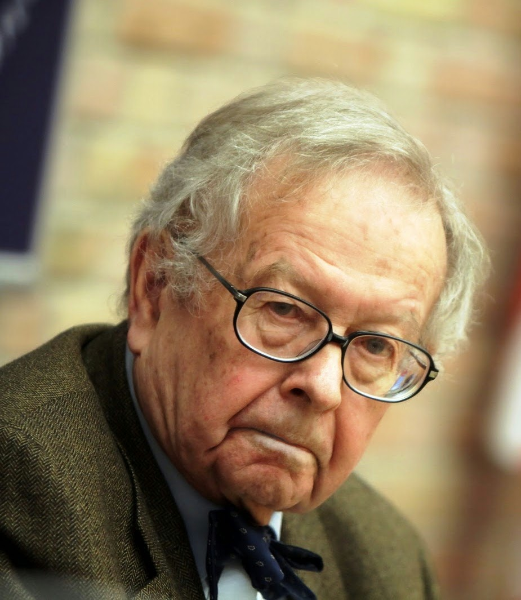

```{r setup, include = FALSE}
knitr::opts_chunk$set(echo = FALSE, message = FALSE, warning = FALSE)

library(pacman)
p_load(dotwhisker, ggplot2, interplot, # Visualization
       RefManageR, emo,# Applied
       # dependency
       readxl, haven, descr, stringi, stringr, arm, car, stargazer, data.table,
       broom, tidyverse) # data wrangling

set.seed(313)
```

## Oh, paradigm!

<div class="centered">

</div>

* What the bi~~ is paradigm?
    + "A model or frame of reference through which to observe and understand." (Babbie 32)
    + Epistemology? Approach? Method? 

## Common Paradigms

* Positivism
* Rational choice
* Structuralism
* Culturalism


## Positivism

"Scientific truths could be positively verified through empirical observations and the logical analysis of what was observed." (Babbie 35)

* Reality is *independent* from human feelings, ideas, perceptions.
* Social phenomena have to be treated like *physical objects*.
* Knowledge is *value-free, objective, measurable*.
* Knowledge can only be accessed objectively through a *scientific approach*.

## Three Pillars 

* Rational choice
* Structuralism
* Culturalism

## Theory

<div class="centered">

</div>

* Paradigm: A way of looking.     
* Theory: An explanation of what we see. 
    + Variables (IVs and DVs)
    + Relations

## Components

* Axioms/assumption
* Proposition/argument

## Example: Structural realism


<div style="float: left; width: 50%;">
* Assumptions
    + International Anarchy
    + States
    + Survival
* Arguments
    + Security dilemma
    + Relative rather than absolute power
</div>

<div style="float: right; width: 50%;">
<div class="centered">

</div>
</div>
    
## Hypothesis

"How reality works as the theory says?"

* Expectation
* Testable
* Real life

## Null hypothesis?

<div class="centered">

</div>

* Baseline: no relation
* Rejecting rather than proving

## Hypotheses of Structural Realism

* Balance of power: internal and external
* Power distribution in the international system
    * Unipolar?
    * Multipolar?
    * Bipolar<br><br><div class="centered">

</div>

## Chain everything up

<div class="centered">

</div>

* Well, deductively...

## Deductive and inductive theories

<div class="centered">

</div>

## Conduct deductive theory

1.	Specify the topic.
1.	Specify the range of phenomena.
1.	Identify and specify concepts (variables).
1.	Find out the relationships.
1.	Reason logically from the propositions to the specific topic.

## Conduct inductive theory

<div class="centered">

</div>

1. Observation
1. Generalization
1. Reasoning

## Big data?

<div style="float: left; width: 70%;">
<div class="centered">

</div>
</div>

<div style="float: right; width: 30%;">
* Valuable
* Dynamic
* Skeptical
</div>


