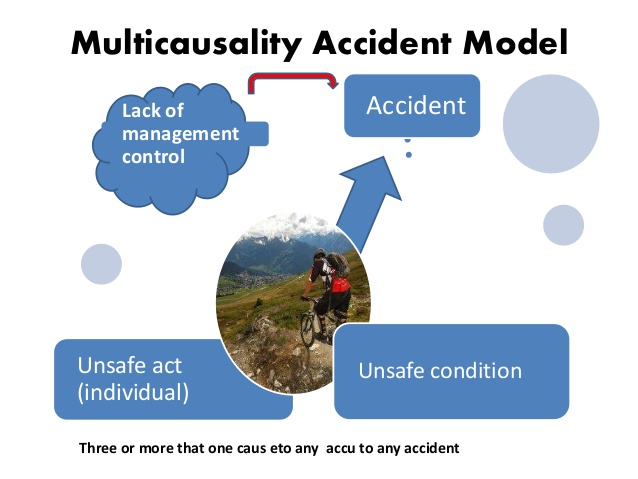

```{r setup, include = FALSE}
knitr::opts_chunk$set(echo = FALSE, message = FALSE, warning = FALSE)

library(pacman)
p_load(dotwhisker, ggplot2, interplot, # Visualization
       RefManageR, emo,# Applied
       # dependency
       readxl, haven, descr, stringi, stringr, arm, car, stargazer, data.table,
       broom, tidyverse) # data wrangling

set.seed(313)
```

## How to understand causation?

<div class="centered">

</div>

* Find A is causal, rather than random, consequence.
* How do we identify the causes of A?
* How do we justify B is a cause of A?


## Pluralist view?

* $\neq$ multicausality<br><br><div class="centered">

</div>

----

Pluralist view: formal causes, material causes, efficient causes, deterministic causes, probabilistic causes, correlational causation, causal mechanisms...

* Different explanations for the same causation
* Different perspective of the same causal explanation.

## Why not pluralist view?

* Over-stating the different-ness
* Not benefiting the research

## A universal view

* A minimal definition
* 16 criteria of formal properties of causal arguments
* 8 criteria for research design

## Defining causation

Cause: Events or conditions that raise the prior probability of some outcome occurring, under ceteris paribus conditions (Gerring 2005, 169).

* $P(Y|X) > P(Y|-X).$
* Why a minimal causation?
    + Hint: Sartori's ladder
* Bayesian framework?
    + $Y(A|B) = \frac{Y(B|A)Y(A)}{Y(B)}$
    + $Posterior = \frac{Likelihood\times Prior}{Evidence}$

## Causal Proposition

<div style="float: left; width: 50%;">
* <span style="color:red">Specification</span>
* Precision
* Breadth
* Boundedness
* Completeness
* <span style="color:red">Parsimony</span>
* <span style="color:red">Differentiation (exogeneity)</span>
* Priority
</div>

<div style="float: right; width: 50%;">
* Independence
* <span style="color:red">Contingency</span>
* Mechanism
* Analytic utility
* <span style="color:red">Intelligibility</span>
* Relevance
* Innovation
* Comparison
</div>


## Criteria of Demonstration

1. Plenitude
1. Comparability
1. Independence 
1. Representativeness
1. Variation
1. Transparency
1. Replicability

## Plenitude

Conducting an empirical based study.

<div style="float: left; width: 50%;">
### Nope
* <div class="centered">

</div>
</div>

<div style="float: right; width: 50%;">
### Yes
* <div class="centered">

</div>
</div>

## Comparability

* Descriptive comparability: 'X' and 'Y' mean roughly the same thing across cases.
* Causal comparability: X and Y do not interact in idiosyncratic ways in different cases.
* Control: the extent to which remaining dissimilarities (of both sorts) may be taken into account.

## Independence and Representativeness

<div class="centered">

</div>

## Variation

<div class="centered">

</div>

## Transparency

<div class="centered">

</div>

## Replicability

<div class="centered">

</div>

## Two strategies to test theory

* Actual case strategy (save for later)
* Counterfactual strategy

## What's counterfactual?

* Claims about events that did not actually occur.<br><br><div class="centered">

</div>

## Relation with hypothesis test?

* Following the experimental logic<br><br><div class="centered">

</div>
* Compromising with the reality

## Differences from the hypothesis test

<div style="float: left; width: 50%;">
### Hypothesis test

* Rely on "ceteris paribus"
* Some probability assumptions
* Can assess the frequencies and magnitudes of the causality
* Uncertainty can be reduced by more cases
</div>

<div style="float: right; width: 50%;">
### Counterfactual

* Rely on general principles, laws, or regularities
* Knowledge of historical facts
* Assess effects based on proliferation
* No formal criterion of uncertainty
</div>


## Why not actual cases?

<div class="centered">

</div>

* Comparability
* Degree of freedom

## When to use?

* Qualitative, mostly
* \# of variables > \# of observations

## Risk

How can we know what would have happened?

<div style="float: left; width: 50%;">
* <div class="centered">

</div>
</div>

<div style="float: right; width: 50%;">
* <div class="centered">

</div>
</div>